# Smart-Home Forecaster — Architecture Review

> A supervisor-routed multi-agent system that warns homeowners about weather hazards to their
> property and answers what they are allowed to do about it — grounded in live government data
> and a cited document corpus, with every safety and numeric decision made in deterministic code
> rather than by the language model.

> **Every home in this demo is invented.** The addresses, builders, HOAs,
> covenants, contractors and utility rates are synthetic — written for this
> project. Only the city and ZIP are real public geography, so free weather APIs
> return genuine forecasts for a plausible point. **The weather is real; the house
> is not.**

| | |
|---|---|
| **Agents** | **7** — supervisor, Router, Researcher, Advisor, Critic, Cost, Pro Finder |
| **Tools** | **13** |
| **Memory layers** | 4 (+ semantic answer cache) |
| **Evaluation** | **43 / 43** — 26 deterministic + 17 end-to-end, on the free model |
| **Cold answer** | 11.7 s (median of 5) |
| **API surface** | **26 endpoints** |

> ### Where these numbers come from
>
> Every timing in this document was re-measured on **2026-08-21** against
> `nvidia/nemotron-3-super-120b-a12b:free`, reported as the **median of 5 samples**,
> and is reproducible with `python scripts/benchmark.py --repeats 5 --advisor`.
>
> The re-measurement was forced rather than chosen. The model this project was
> built and evaluated on — `openai/gpt-oss-20b:free` — was withdrawn from
> OpenRouter's free tier that morning and began returning `404 This model is
> unavailable for free`, so every figure taken on it described a system nobody
> could run any more. Free model slugs rotate; `python scripts/check_free_model.py`
> reports whether the pinned one is still alive.
>
> **Free endpoints are variable, and the ranges say so.** A flagship weather
> answer spans 6.9–14.5 s and a high-risk referral 8.7–44.2 s across five
> samples. Medians are quoted throughout; a single number is a typical answer,
> not a guarantee.
>
> **Some figures deliberately keep their original values.** The before/after
> pairs in §8 and §15 measure optimisations whose "before" is *deleted code* —
> the six-call weather chain, the six-criterion critique. They cannot be re-run
> without reverting the very changes they justify, and they were measured
> like-for-like on one model at one commit, so the comparison remains valid
> evidence for the decision it supports. Those are labelled with the model they
> came from, and today's equivalent is given alongside.
>
> **A flapping test turned out to be a real defect.** A15 (*a renter is grounded
> on tenant rules, not owner covenants*) alternated pass/fail across four runs of
> identical code, and was initially called an over-specified assertion. Measuring
> it said otherwise: the Renter/Tenant Policy Summary was retrieved and then
> dropped by the cross-encoder (scoring −5.94 against a −4.0 floor) whenever the
> model phrased its search around the physical change rather than around tenancy.
> The answer it produced — *"you need your landlord's permission"* — was correct,
> but came from general knowledge rather than this home's lease terms. **An
> ungrounded answer that happens to be right is exactly the failure `grounded`
> exists to make visible.**
>
> Fixed by widening the query rather than the threshold: a renter's governing
> document is now retrieved deterministically for alteration questions and
> appended if it clears the same bar as everything else. Lowering the threshold
> was rejected — shipping weak passages for the model to ignore is how invented
> rules happen. A15 now passes four consecutive runs.

### Measured figures, 2026-08-21

Median of 5 samples on `nvidia/nemotron-3-super-120b-a12b:free`.

| Measurement | Median | Range | n |
|---|---:|---:|---:|
| Router verdict | 0.12 ms | 0.12 – 0.18 ms | 50 |
| BM25 lexical search | 0.04 ms | 0.04 – 88 ms | 15 |
| Cross-encoder rerank (5 passages) | 66 ms | 63 – 120 ms | 15 |
| Full RAG search, cold | 584 ms | 418 – 1031 ms | 15 |
| Pro directory lookup | 2.5 ms | 1.4 – 9.9 ms | 15 |
| Advisor high-risk short-circuit | 1.2 ms | 1.1 – 2.4 ms | 5 |
| **Weather answer (flagship)** | **11.7 s** | 6.9 – 14.5 s | 5 |
| Policy answer (RAG + citation) | 11.2 s | 6.0 – 17.4 s | 5 |
| Cost answer | 20.5 s | 12.8 – 30.5 s | 4 |
| High-risk referral | 21.6 s | 8.7 – 44.2 s | 4 |
| **DIY answer (beam search)** | **48.9 s** | 41.4 – 96.0 s | 5 |
| Cached answer (repeat/paraphrase) | ~0.25 s | — | 5 |
| Advisor propose call | 4.6 s | 2.9 – 14.4 s | 5 |
| Advisor critique call | 14.4 s | 7.3 – 20.5 s | 5 |
| Full advisor run, depth 1 | 25.9 s | 20.0 – 37.9 s | 5 |
| Full advisor run, depth 2 | 53.8 s | 43.8 – 75.4 s | 5 |

Two rows report n=4: one sample each returned no answer, and a failed sample is
excluded rather than counted as zero. The cached figure is end-to-end over HTTP;
measured in-process it is 1.5 ms, which is true and is not a number any user can
observe.


| **Python modules** | 64 |
| **Rubric weight not model-authored** | **63%** |

> **Some sections below describe an earlier stage of the design**, when there were
> six specialists and 33 evaluation cases. They are kept because the *reasoning*
> in them is still correct — why a supervisor-with-tools beat a peer graph, why the
> composite tool won, why a cross-encoder was added on top of the bi-encoder. Where
> a **count** differs, the figures in the table above are current, and
> [`agents.md`](agents.md) carries the seven-agent census.

Mermaid diagrams below render on GitHub, in VS Code with a Mermaid extension, and in most
Markdown viewers. An interactive HTML version is at
[`architecture-review.html`](architecture-review.html).

> **New to the project?** Start with [`how-it-works.md`](how-it-works.md) instead — a
> plain-language tour that assumes no prior knowledge of agents, RAG, or vector databases.
> This document assumes all of it and focuses on defending the design decisions.

---

## Contents

1. [What the system is](#1-what-the-system-is-and-the-problem-it-solves)
2. [System context](#2-system-context)
3. [Runtime topology](#3-runtime-topology-and-the-three-entry-points) · [3.1 Run modes](#31-run-modes-the-same-system-on-two-service-stacks)
4. [Agent topology](#4-agent-topology-one-supervisor-four-specialists)
5. [Anatomy of one turn](#5-anatomy-of-one-turn-end-to-end)
6. [The ReAct loop](#6-the-react-loop-and-how-recovery-actually-works)
7. [Tool catalogue](#7-tool-catalogue)
8. [The composite tool](#8-the-composite-tool--the-largest-single-win)
9. [RAG pipeline](#9-rag-a-three-stage-retrieval-pipeline)
10. [Memory architecture](#10-memory-architecture-four-layers-plus-a-cache)
11. [Tree-of-Thought advisor](#11-the-advisor-genuine-tree-of-thought)
12. [Cost specialist](#12-the-cost-specialist-auditable-arithmetic-llm-presentation)
13. [Safety architecture](#13-safety-architecture)
14. [Resilience & fallbacks](#14-resilience-every-dependency-has-a-fallback)
15. [Cost & token optimisation](#15-cost-and-token-optimisation)
16. [Caching strategy](#16-caching-strategy)
17. [Observability](#17-observability)
18. [Evaluation](#18-evaluation)
19. [Frameworks & stack](#19-frameworks-and-stack)
20. [Design principles](#20-design-principles)
21. [Defect log](#21-defect-log--how-the-architecture-was-derived)
22. [Known limitations](#22-known-limitations)
23. [Review Q&A](#23-review-qa--likely-challenges)
24. [The forecaster speaks first](#24-the-forecaster-speaks-first)
25. [The Researcher, and untrusted text](#25-the-researcher-and-untrusted-text)

---

## 1. What the system is, and the problem it solves

> A general-purpose chatbot cannot tell you whether *your* pipes will freeze tonight. It has no
> address, no live forecast, no copy of your HOA covenants, and no way to verify anything it says.
> This system is built specifically to close those four gaps.

The product is a **Forecaster**: an assistant that watches the weather against a specific property
and tells the occupant what to do about it. Its flagship job is detecting an incoming freeze and
giving concrete protective steps before pipes burst. Around that core it answers three adjacent
questions homeowners actually ask — *am I allowed to do this to my house?*, *how should I do this
job?*, and *what is this costing me?*

Architecturally the interesting claim is not "we called an LLM." It is **where the decisions live**.
Risk levels, dollar figures, and emergency detection are computed in ordinary Python — arithmetic,
threshold bands, and regular expressions — and the language model is confined to routing, retrieval,
explanation, and presentation. That split is the spine of every section below.

### The six capabilities the system was required to demonstrate

| Capability | Implementation | Where it lives |
|---|---|---|
| **Tool calling** | 12 typed tools bound to the model, with docstrings written for the model as the reader | `tools/agent_tools.py` |
| **Reasoning loop + recovery** | ReAct loop over LangGraph; every external dependency has a fallback and errors return as data | `agents/orchestrator.py` |
| **Knowledge & memory** | Filtered → hybrid → reranked RAG, plus conversation, episodic and working memory | `memory/` |
| **Further reasoning** | Genuine multi-call Tree-of-Thought: branch, evaluate, select as separate LLM calls | `agents/advisor.py` |
| **Multi-agent coordination** | Supervisor routes to six specialists (see `agents.md`); sub-agents exposed as tools | `agents/orchestrator.py` |
| **Safety** | Four deterministic guardrails at the orchestrator boundary, one of which bypasses the model entirely | `tools/safety.py` |

> **The thesis to lead with.** Every component in this system exists because a specific failure was
> observed and measured. The cross-encoder reranker exists because a "pet tiger" question scored
> 0.409 against an HOA landscaping passage and would have been answered from it. The composite
> weather tool exists because a single question was costing five sequential model round-trips. The
> audience filter exists because the Owner/Renter toggle turned out to have no effect on retrieval at
> all. **The defect log in §21 is the strongest evidence in this document** — it shows the
> architecture was derived, not guessed.

---

## 2. System context

Start at the outside edge: who talks to the system, and what the system talks to. Everything the
system knows about the real world arrives through one of the external services on the right.

### Figure 1 · System context (C4 level 1)

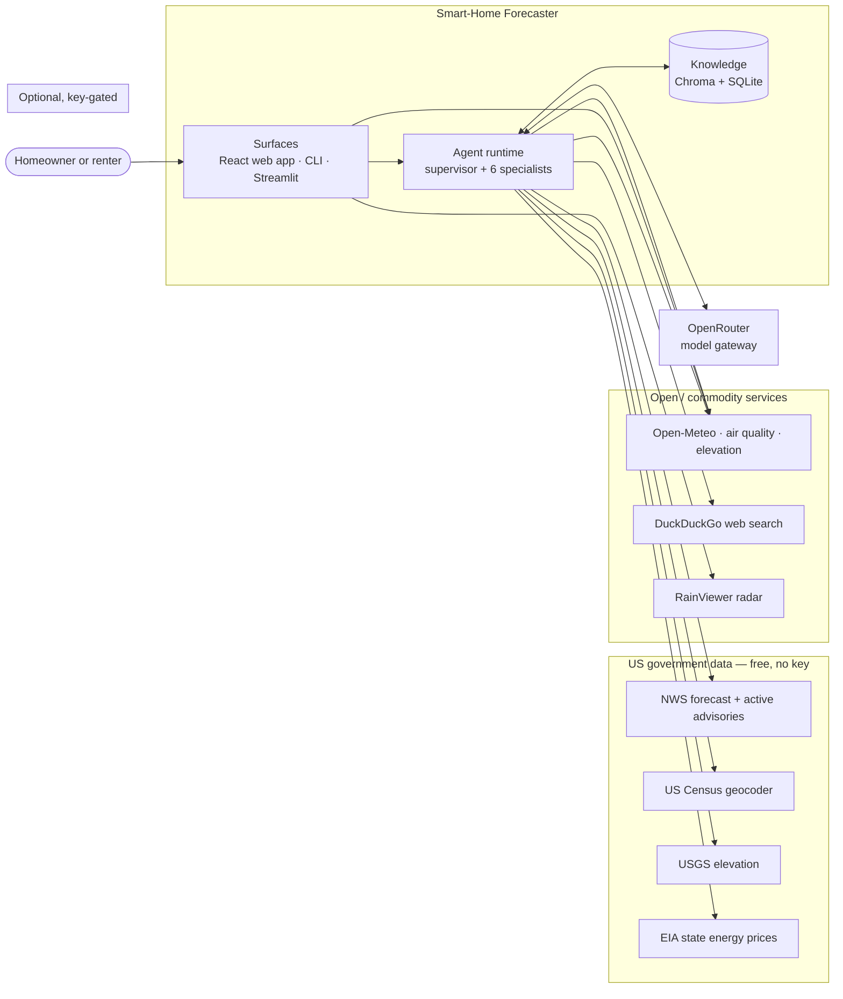

**Read the right-hand column as a trust gradient.** Government sources are authoritative and
preferred where they are authoritative, and open services cover everything else. No provider in this build requires a key or a card.
system runs perfectly well without.

#### How to read Figure 1

1. **One human role, three surfaces.** The same agent core is reachable from a React web app, a
   command-line entry point, and a legacy Streamlit UI. That is deliberate and is explained in §3 —
   it is not accidental duplication.
2. **The agent is the only thing that talks to data sources.** The UI never invents its own weather
   logic; the dashboard calls the *same* tool functions the agent calls, so the chart and the chat
   answer can never disagree about the temperature.
3. **Government first.** NWS is the authoritative forecast and the only source of official
   advisories. Census is authoritative for US street addresses. EIA is authoritative for state
   energy prices. These are chosen for defensibility, not convenience.
4. **Open-Meteo appears in three roles** — forecast, geocoding, elevation — because it is the
   designated backup for each. That single service is what makes the "runs with zero API keys"
   property true.
5. **The model gateway is on its own.** OpenRouter is an OpenAI-API-compatible façade in front of
   many model providers. Talking to it through the standard OpenAI client means the model is a
   swappable configuration value, not an architectural commitment.
6. **The optional box is a strategic constraint.** Anything requiring a billing account is boxed off
   and has a working fallback, so the system can be cloned and run by a reviewer with no accounts at
   all.

> **Data governance.** The project is bound by a **public, synthetic, or anonymised data only** rule.
> Every live source above is a free public API. Everything that would otherwise be private — the home
> profile, the HOA covenants, the contractor directory, the utility rates, the floor plan — is
> synthetic and carries an in-file `SYNTHETIC DOCUMENT` header. The login is a demo credential pair
> that persists no user records. This is why there is no user database anywhere in the diagram.

---

## 3. Runtime topology and the three entry points

The deployed system is two processes: a Vite dev server serving the React front-end, and a FastAPI
application hosting the agent. The browser calls the API **directly** on port 8000 — cross-origin,
with CORS configured for the dev and preview origins — and receives chat as a Server-Sent Events
stream.

> **Why not the dev-server proxy?** The front-end originally reached the API through Vite's `/api`
> proxy, which is the conventional arrangement. It was removed after measurement: on the development
> machine, **~20 % of requests through the Vite 8 proxy hung indefinitely** — no error, no retry, no
> timeout — while 20/20 of the identical calls made straight to uvicorn returned in 28–63 ms. Because
> FastAPI's timing middleware records *after* a handler returns, a hung request produced no log line
> at all, so the failure looked like a request that had never arrived. `web/src/api.js` now routes
> every call through `apiUrl()`, whose base comes from `VITE_API_BASE` (default
> `http://127.0.0.1:8000`; set it to `""` when the built bundle is served by FastAPI itself, which
> makes everything same-origin again). See §21, defect 31.

### Figure 2 · Process and module topology (C4 level 2)

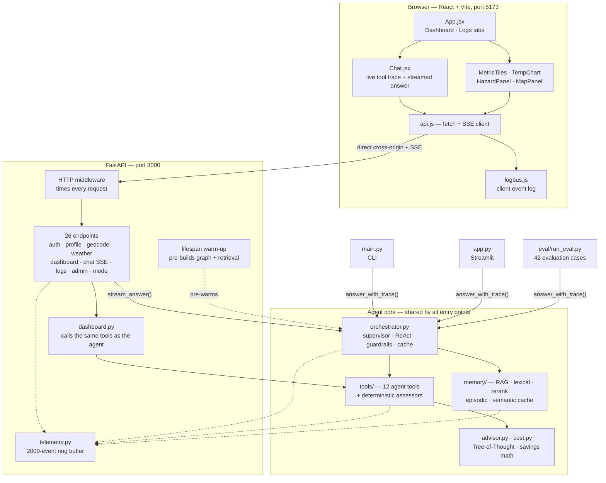

**Two entry points into the same core.** `stream_answer()` is an event generator feeding SSE;
`answer_with_trace()` blocks and returns one result. Everything below that line is shared.

#### How to read Figure 2

1. **The browser keeps its own log.** `logbus.js` is a client-side event bus that mirrors the
   backend's event shape. It stays client-side on purpose: the interesting front-end events happen
   *while* a long answer is streaming, and shipping one request per event would distort the very
   thing being measured.
2. **The dashboard does not go through the agent.** `dashboard.py` calls the tool functions
   directly. The agent path is for questions; the dashboard path is for continuously-displayed
   metrics. They share the tools so the numbers always match.
3. **The warm-up hook is a demo-reliability feature.** On startup, FastAPI's `lifespan` pre-builds
   the agent graph and runs one throwaway retrieval query — which loads the embedding model, builds
   the BM25 index, and downloads the reranker weights. Without it, that entire cold-start cliff lands
   on whoever asks the first question, which during a live demo is the worst possible moment. It runs
   via `asyncio.to_thread` so it does not block the server accepting connections.
4. **Two entry-point functions, deliberately.** `stream_answer()` yields typed events for the SSE
   feed. `answer_with_trace()` returns a completed result and is used by the CLI, Streamlit, *and the
   evaluation suite*. Both call the same `_prepare_turn()` front-half so they can never drift apart
   on safety behaviour.
5. **Why keep Streamlit at all?** If it were removed, `answer_with_trace()` would have exactly one
   consumer — the test suite — meaning the suite would be testing a code path no human ever runs.
   Keeping a real UI on the blocking path means a bug there gets caught twice.
6. **Telemetry is a sink, never a dependency.** The dotted lines run one way. Nothing waits on the
   log, and nothing fails because logging failed.

> **Design decision worth defending.** Adding streaming to the Streamlit UI was considered and
> **rejected on architectural grounds, not effort**. The two entry points are a deliberate split.
> Migrating Streamlit onto the streaming path would orphan the blocking path, and the blocking path
> is what the entire regression suite runs on. As a bonus, the fact that the Streamlit UI cannot
> stream is itself the documented justification for why the React front-end was built.

### 3.1 One service stack, free and keyless

The project carries a hard constraint — **it must be demonstrable at zero cost** —
and the architecture takes that seriously rather than treating it as a limitation
to apologise for.

| Capability | Provider | Cost tier |
|---|---|---|
| Language model | `nvidia/nemotron-3-super-120b-a12b:free` | free |
| Forecast + advisories | NWS (weather.gov) | government |
| Weather detail + air quality | Open-Meteo | free |
| Geocoding | US Census → Open-Meteo | government |
| Elevation | Open-Meteo → USGS | government |
| Energy prices | EIA open data | government |
| Jurisdiction lookup | US Census geographies | government |
| Web search | DuckDuckGo | free |
| Embeddings + reranking | MiniLM / ms-marco (local ONNX) | free |
| Map tiles | Leaflet / OpenStreetMap | free |

Three properties make this architectural rather than incidental:

1. **The build refuses to run on a metered model.** This is not a default that can
   drift — an evaluation case asserts it, and `set_demo_mode(False)` returns `True`
   rather than obeying. There is no paid stack behind the switch, so the interface
   renders no mode control at all rather than a toggle that half-works.
2. **Government APIs carry the load-bearing data.** NWS, EIA and Census cost
   nothing and are authoritative, which is a better position than paying for a
   commercial wrapper around the same source.
3. **The stack is honest about itself.** `config.service_matrix()` reports the live
   provider and cost tier for every capability, and the UI renders it. **No row is
   `billed`** — a claim a reviewer can verify on screen rather than take on trust.

**Mechanism.** `config.py` holds the single source of truth: `demo_mode()`,
`active_model()` and `provider_allowed()`. These are *functions, not module
constants* — a caller doing `from config import SOME_FLAG` would capture the value
at import time and never observe a change. `provider_allowed()` is AND-ed, never
OR-ed: a keyed or billable provider is refused **even when a key is present in
`.env`**, so a stray credential cannot quietly change what the system reaches for.

> **Consequence worth stating plainly.** A small free model may be slower and less
> reliable at multi-step tool use than a frontier one. How much slower is currently
> an open question: the old figure — roughly 45 s versus 15 s per question — was
> measured against `openai/gpt-oss-20b:free`, which has since been withdrawn, and
> the model that replaced it answers a weather question in **11.7 s**. The stale
> ratio is withdrawn rather than restated. That is the cost of the zero-cost constraint, and it is
> the reason **no safety control depends on the model**: every guardrail, hazard
> rating and refusal is deterministic code that behaves identically regardless of
> which model is answering. The safety argument is written against the weakest
> model the system supports, because that is the one it runs on.

---

## 4. Agent topology: one supervisor, six specialists

> **Superseded on the count — see [`agents.md`](agents.md).** There are now
> **seven** agents: the Router, the Researcher and the Pro Finder were added
> later, and the Critic was split out of the Advisor. The reasoning below about
> *why* a supervisor-with-tools was chosen over a peer graph still holds, which is
> why the section is kept rather than deleted.

The orchestrator is an explicit **supervisor**. It does not try to answer everything itself; it
classifies the question and routes to the specialist that owns that domain, then composes the results
when a question spans more than one.

### Figure 3 · Supervisor and specialists

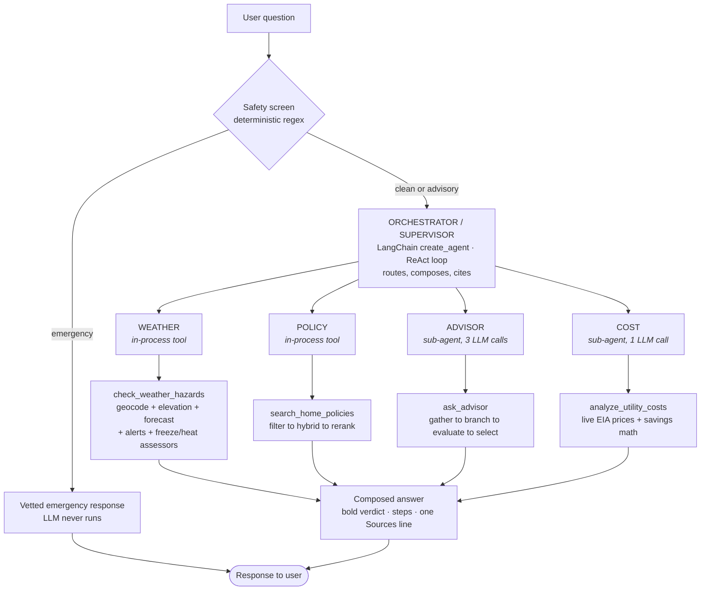

**Two specialists are tools; two are agents.** Weather and Policy are deterministic pipelines.
Advisor and Cost are LLM-driven sub-agents invoked through the agent-as-tool pattern.

#### How to read Figure 3

1. **The guardrail is upstream of the supervisor, not inside it.** A life-safety emergency never
   reaches the model at all — see §13. Everything else passes through, sometimes carrying a hard
   prompt override.
2. **Routing is instructed, not learned.** The system prompt names the specialists and gives an
   explicit tie-break rule: *if a question mentions a bill, cost, rate, or saving money, always use
   COST* — even when phrased as "how do I…". That rule exists because without it the model routed
   money questions to ADVISOR and the answer came back with no dollar figures.
3. **Agent-as-tool is the coordination pattern.** Advisor and Cost are exposed to the supervisor as
   ordinary tools (`ask_advisor`, `analyze_utility_costs`). The supervisor does not know they contain
   their own LLM calls; it just sees a tool that returns a structured recommendation. This keeps the
   supervisor's graph flat and its context small.
4. **Weather and Policy are not agents.** Calling them "specialists" is about domain ownership, not
   about them having their own reasoning loop. Weather is a deterministic pipeline; Policy is a
   retrieval pipeline. Neither needs an LLM of its own, so neither has one.
5. **Composition happens at the supervisor.** A question like "it's going to freeze — can I run a
   space heater in the garage under my lease?" legitimately needs Weather and Policy, and the
   supervisor merges both into a single answer with one combined `Sources` line.

### Why supervisor-with-tools rather than a peer graph

A common alternative is a graph of peer agents that hand off to each other. That was not chosen, for
three reasons worth stating plainly at review:

- **Context economy.** In a peer-handoff design each agent tends to receive the full conversation.
  Here the sub-agents receive only a single scoped question string, so the Advisor's three LLM calls
  never carry the orchestrator's history or its twelve tool schemas.
- **Failure containment.** A sub-agent that fails returns a tool error the supervisor can reason
  about and recover from. A peer that fails mid-handoff can strand the graph.
- **Auditability.** One supervisor writes the final answer, so there is exactly one place where the
  citation rules, the answer shape, and the safety disclaimer are enforced.

> **Cost note.** The delegation pattern is not free. `ask_advisor` costs **three additional LLM
> calls** inside one supervisor tool call, which is why the Tree-of-Thought evaluation case (A6)
> takes ~49 s against ~12 s for a weather question. That is an accepted, measured trade: the
> branch/evaluate/select structure is the point of that feature.

---

## 5. Anatomy of one turn, end to end

> This is the diagram to spend the most time on. Everything else in the document is a zoom into one
> band of it. It shows exactly what happens between a user pressing Send and an answer appearing.

### Figure 4 · Full request lifecycle

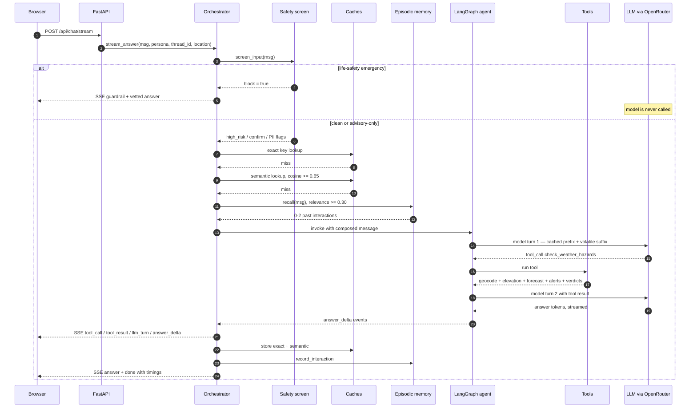

**Order is the architecture here.** Safety runs before caching; caching runs before memory; memory
runs before the model. Each of those orderings is a deliberate correctness decision.

#### How to read Figure 4 — and why the ordering is what it is

1. **Safety screens the live input first.** If the guardrail sat behind the cache, a cached answer
   could be served for a message that *this time* contains an emergency. Guardrails must always see
   the real words the user just typed.
2. **Emergencies short-circuit everything.** On the emergency branch the model is never invoked, no
   cache is consulted, and nothing is persisted. The response is a fixed, human-vetted instruction
   string. This is the single most important safety property in the system.
3. **The cache is consulted in two passes.** First an exact-match key, then a semantic (embedding)
   match at cosine ≥ 0.65. Persona and location are *exact-match identity* and never fuzzy — the same
   words about a different city are a different question. Anything that tripped any guardrail is
   never cached in either direction.
4. **Episodic recall is relevance-gated and silent.** Only memories scoring ≥ 0.30 cosine are
   injected. Below that, nothing is injected and the model is never told a weak memory existed —
   because passing along a 0.2-similarity memory "with a caveat" reliably drags answers toward the
   stale topic.
5. **The composed message is assembled in a fixed order** — persona, viewed location, recalled
   memory, safety override, then the question tagged `CURRENT QUESTION`. That tag exists because a
   failed turn still gets checkpointed, and without it the model would sometimes answer the earlier,
   unanswered question instead.
6. **Two model turns is the target shape.** Turn 1 decides which tool to call; turn 2 receives the
   result and writes the answer. §8 explains how that was reduced from five.
7. **Both writes happen after the answer is emitted.** The user is never waiting on the cache write
   or the memory write. Both are wrapped so that a failure in either can never cost the user their
   answer.
8. **Every arrow back to the browser is a typed SSE event** — `guardrail`, `memory`, `tool_call`,
   `tool_result`, `llm_turn`, `answer_delta`, `answer`, `done`. The UI renders the ReAct loop as it
   happens rather than showing a spinner for 12 seconds.

> **A subtlety worth calling out at review.** The final `answer` event is sent *even though* the text
> was already streamed token by token. The deltas are display-only; the completed message is the
> authoritative copy. That lets the client replace whatever it accumulated rather than trusting its
> own concatenation — which matters because streaming can be interrupted, coalesced, or reordered by
> an intermediary.

---

## 6. The ReAct loop and how recovery actually works

**ReAct** is *Reason → Act → Observe*, repeated. The model reasons about what it needs, emits a tool
call, receives the result as a new message, and reasons again with that result in context. The loop
terminates when the model emits a message with no tool calls — that message is the answer.

### Figure 5 · ReAct loop with error recovery

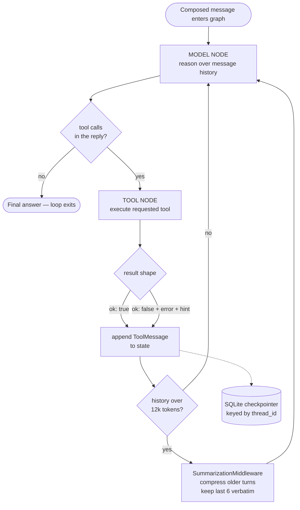

**Errors are returned, never raised.** A failed tool produces a normal message the model can read and
reason about, which is what makes recovery possible rather than fatal.

#### How to read Figure 5

1. **The loop is a two-node cycle.** Model node → tool node → model node. LangGraph owns the cycle
   and the message state; the application supplies the tools and the prompt.
2. **Tools never raise into the loop.** Every tool returns a dict. On failure it returns
   `{"ok": false, "error": "...", "hint": "..."}`. The model reads that as an observation and can try
   a different approach — for example, re-attempting a geocode with a simpler `City, ST` form. *This
   is the concrete evidence of "recovers from missteps"*, and it only works because failures are
   data.
3. **Summarisation, not truncation.** Once message history exceeds 12,000 tokens,
   `SummarizationMiddleware` compresses the older turns and keeps the six most recent verbatim.
   Truncating would silently drop a correction the user made earlier; summarising preserves it.
4. **State is checkpointed to SQLite on every step**, keyed by `thread_id`. That is what makes
   conversations survive a process restart and what makes "resume this conversation" in the UI
   restore the *agent's* memory, not just the transcript.
5. **The middleware's own LLM call is filtered out of the stream.** Summarisation runs a model call
   of its own; a token filter checks that the emitting node is `model` before forwarding any text, so
   a summary can never leak into the chat bubble.

### Two prompt-level failures that a diagram will not show you

Both were found by the evaluation suite and both were fixed in the prompt rather than in code, which
makes them good review material about how agentic systems actually break.

- **The obvious-answer skip.** When the forecast looked plainly warm, the model would skip
  `assess_freeze_risk` and give its own verdict. The prompt now requires the assessor to run *even
  when the answer seems obvious*, and states that a "no risk" conclusion must come from the tool,
  never from the model.
- **The instruction-conflict stall.** "Confirm the address with the user" and "finish the task"
  contradicted each other, and the agent halted mid-chain whenever a geocode came back marked
  *approximate*. Fixed with an explicit precedence rule: *finish the task and state your assumption;
  only the safety rules may cut a task short.* The general lesson — conflicting soft instructions do
  not produce a compromise, they produce a stall — is worth stating out loud at review.

---

## 7. Tool catalogue

Twelve tools are bound to the supervisor. The list order is fixed and must stay fixed — tool schemas
render at the very front of the prompt, so reordering the list would invalidate the prompt cache
described in §15.

| # | Tool | Specialist | Returns | Decision by |
|---|---|---|---|---|
| 1 | `get_home_profile` | — | Address, HVAC, plumbing, appliances from the synthetic profile | code |
| 2 | `check_weather_hazards` | Weather | Location, forecast, freeze verdict, heat verdict, active advisories — **in one call** | code |
| 3 | `geocode_address` | Weather | lat/lon, matched address, source, `approximate` flag | code |
| 4 | `get_elevation` | Weather | Elevation in m and ft | code |
| 5 | `get_weather_forecast` | Weather | min/max temps + a 6-hourly sample, and which source answered | code |
| 6 | `assess_freeze_risk` | Weather | `none·low·moderate·high·severe` + actions + wind chill | code |
| 7 | `assess_heat_risk` | Weather | Heat-index level + protective actions | code |
| 8 | `get_weather_alerts` | Weather | Active NWS advisories: heat, Red Flag, storm, flood, wind, winter | code |
| 9 | `search_home_policies` | Policy | Cited passages + a `grounded` boolean | code |
| 10 | `ask_advisor` | Advisor | Recommendation + scored option tree + sources | **LLM ×3** |
| 11 | `analyze_utility_costs` | Cost | Itemised savings, rate used, whether prices were live | **LLM ×1** |
| 12 | `recall_memory` | Memory | Past interactions matching a query, with age | code |

### Three conventions that make the tool layer work

**Docstrings are prompt engineering.** The model never sees the implementation — it sees the
decorated wrapper's signature and docstring, and that is the entire basis on which it decides when
and how to call a tool. So the docstrings are written for that reader. `check_weather_hazards` is
explicitly labelled *PREFERRED tool for any weather-safety question* and names the six tools it
replaces. `geocode_address` ends with "do NOT stop to ask the user to confirm the address — finish
the assessment first," because that is where the stall in §6 originated.

**The model is forbidden from judging numbers.** Tools 6 and 7 return a `level` and a list of
`actions`, and the prompt requires the model to report both *exactly as returned*. The very first
defect logged in this project was an LLM calling a 28 °F forecast "no risk." The bands are now a
table in Python — 20 °F severe, 28 °F high, 32 °F moderate, 36 °F low — and no prompt change can move
them.

**Persona is passed out-of-band, never as a tool argument.** `search_home_policies` reads the
owner/renter persona from the LangGraph run config via `get_config()`, not from a parameter the model
fills in. The reasoning is sharp: a model that chooses its own metadata filter can filter itself into
an empty result set, and that failure is *invisible* — it looks exactly like "no source exists for
this," which is the one answer this system must never give wrongly.

---

## 8. The composite tool — the largest single win

> A weather question used to cost five sequential model round-trips. It now costs one tool call. Wall
> clock fell from 29.0 s to 13.5 s on the flagship question, measured like-for-like on the same model
> and network.
>
> **Both figures are from `openai/gpt-oss-20b:free`, before it was withdrawn.** They are kept as a
> pair because the "before" is the six-call chain this section deleted — it cannot be re-run without
> restoring it. On the current model the composite path measures **11.7 s**.

### Figure 6 · Granular chain vs composite tool

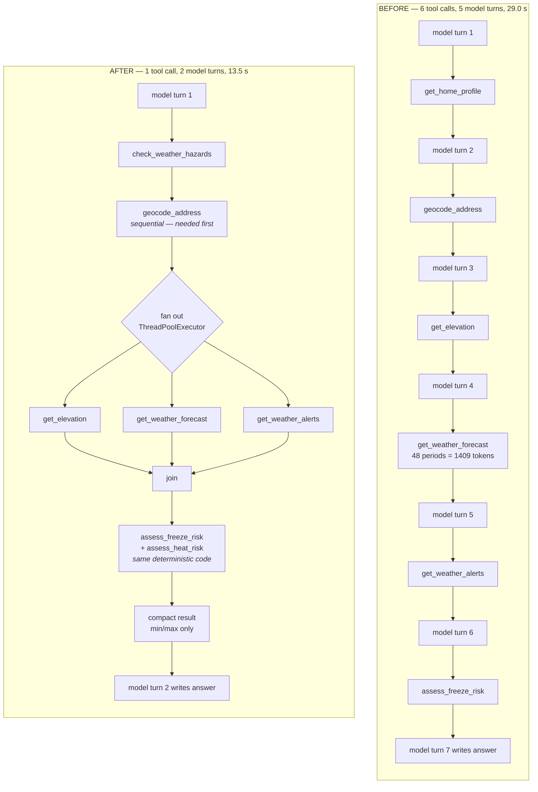

**Nothing about the decisions changed.** The same assessors run on the same data. What changed is how
many times the model had to be re-invoked to get there.

#### How to read Figure 6 — and the insight behind it

1. **The cost was never the HTTP calls.** The measured breakdown showed the model was ~88 % of a
   turn's wall clock. Five extra HTTP requests cost milliseconds; five extra *model round-trips* cost
   seconds each.
2. **Why the chain was sequential at all.** In a ReAct loop the model must *see* each tool result
   before it can decide what to request next. So the chain length was not a network problem, it was a
   control-flow problem — and the only way to shorten it is to give the model fewer decisions to
   make.
3. **The composite collapses six decisions into one.** The model asks a single question — "assess the
   hazards at this location" — and the tool does the entire chain internally.
4. **Inside the tool, independence is exploited.** Geocoding must happen first because everything
   else needs coordinates. But elevation, forecast and alerts are mutually independent given
   coordinates, so they run concurrently on a thread pool. Threads rather than asyncio because each
   is a blocking `requests` call.
5. **The payload shrinks on the way out.** The 48 hourly forecast periods never reach the model — it
   only ever used the min and max. Those 1,409 tokens were not just sent once; they were re-sent on
   every subsequent turn *and* retained in checkpointed conversation state.
6. **The granular tools were not deleted.** All six remain registered as the recovery path, for the
   unusual case where the model already has coordinates and needs one number, or where the composite
   failed. The prompt tells it not to use them for the normal path.

| Metric | Before | After |
|---|---:|---:|
| Wall clock | 29.0 s | **13.5 s** (−53 %) |
| Model turns | 5 | **2** |
| Tool calls | 6 | **1** |
| Input tokens | 36,078 | **14,362** (−60 %) |
| — of which served from cache | 0 | **6,380** |
| Time to first word | never (29 s of silence) | **8.8 s** |

> **How the baseline was established.** The "before" numbers were not extrapolated. The old granular
> tool chain was **forced back on and re-measured** on the same model and the same network, so the
> comparison is like-for-like. If one number in this deck gets challenged, it will be this one — and
> that is the answer.

---

## 9. RAG: a three-stage retrieval pipeline

A policy answer is only as trustworthy as the passage it cites, so retrieval is not a single vector
query. It is three stages, and **each degrades independently**: if the reranker weights cannot be
downloaded, retrieval falls back to hybrid order; if the BM25 index is unavailable, it falls back to
dense alone.

### Figure 7 · Retrieval pipeline

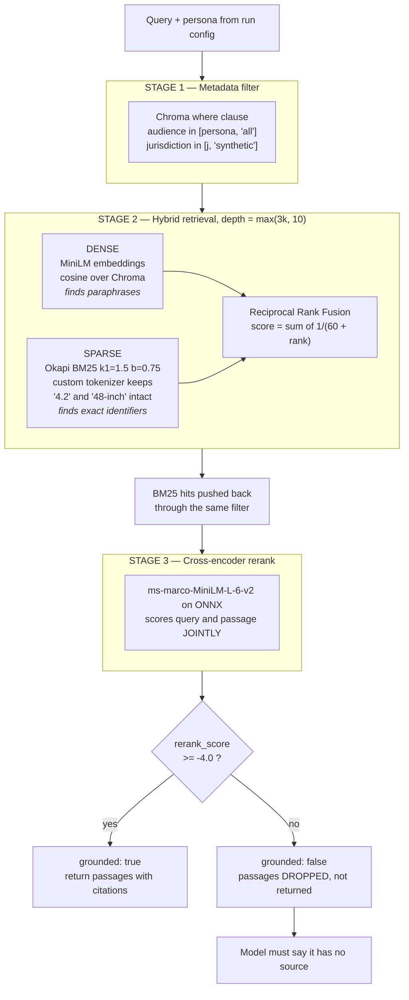

**Below-threshold passages are dropped, not returned with a low score.** Handing the model text it
must then decide to ignore is exactly how invented rules happen.

#### How to read Figure 7, stage by stage

1. **Stage 1 narrows the search space before any scoring.** Chunks carry an `audience` tag. Before
   this existed, the Owner/Renter toggle had *zero effect on retrieval* — a renter asking about the
   lawn was grounded on owner covenants. That was a correctness bug, not a performance tweak.
2. **The filter is an `$in`, never an equality.** The naïve instinct is to tag the HOA covenants as
   `owner`. That is wrong: a renter is bound by the CC&Rs *through their lease*. Hard-filtering them
   would hide a real obligation — a far worse failure than showing one extra passage. So `audience`
   tags only what genuinely does not apply (tenant-rights material from owners, owner-as-host
   short-term-rental rules from renters), and everything binding both stays in a shared `all` bucket.
3. **Stage 2 runs two fundamentally different retrievers.** Dense embeddings understand *meaning* —
   they find the xeriscaping section for "can I put rocks down." BM25 scores *exact term overlap* —
   it finds `CC&R 4.2`, `ARC`, `48-inch`. Those are precisely the tokens embeddings blur, and
   precisely the tokens citations depend on.
4. **Reciprocal Rank Fusion combines them by rank, not by score.** Cosine similarity and BM25
   magnitude are incomparable scales; normalising them against each other is guesswork. RRF sidesteps
   that entirely: each list contributes `1 / (60 + rank)`. The constant 60 is from the original RRF
   paper and damps the top ranks just enough that one list cannot dominate the other.
5. **BM25 hits are re-filtered.** BM25 scores the whole corpus, so its hits must be pushed back
   through the same metadata filter — otherwise the keyword leg would quietly reintroduce exactly the
   passages stage 1 just excluded. This is a subtle bug class in hybrid systems and it is worth
   pointing at.
6. **Stage 3 is what makes the threshold trustworthy.** See below — this is the single best technical
   story in the retrieval design.
7. **The net is cast wider than the return.** Retrieval depth is `max(3k, 10)` and the rerank
   shortlist is `max(2k, 8)`, because fusion and reranking can only reorder what they are given. A
   passage the dense leg ranked 6th can still win.

### Bi-encoder vs cross-encoder — the concept, and the bug it fixed

A **bi-encoder** (what a normal vector store uses) embeds the query and the passage *separately* and
compares the two vectors. Because the passage was embedded without ever seeing the query, the score
measures *topical neighbourhood* — "are these about similar things?" — not "does this passage answer
this question?"

A **cross-encoder** feeds the query and the passage through the model *together* as one input and
outputs a single relevance logit. It is far more accurate and far more expensive, which is why it is
used as a second-stage reranker over a shortlist rather than as the primary index.

| Query | Dense (threshold 0.35) | Verdict | Cross-encoder (threshold −4.0) | Verdict |
|---|---:|---|---:|---|
| "replace grass with stones" — the corpus really answers this | 0.498 | grounded ✅ | −1.25 | grounded ✅ |
| "keep a pet tiger in my backyard" — nothing addresses this | 0.409 | **grounded ❌** | −8.41 | refused ✅ |
| **Separation** | **0.09** | straddles the line | **7.16** | clean band |

The pet-tiger query scored above the grounding threshold *purely because both texts mention a
backyard*. The only thing standing between that and an invented HOA rule was a prompt instruction
telling the model to refuse. The cross-encoder turns a 0.09 gap into a 7-point gap, which is what
makes a threshold mean something.

> **Thresholds are calibrated, and the measurements are kept.** `MIN_RERANK_SCORE = −4.0` was chosen
> by running seven probe queries — four that should ground, three that should not — and picking a
> value inside the empty band: ~2.7 of margin below the weakest true match, ~2.4 above the strongest
> false one. The probe table is a comment in the source and `python -m memory.rerank` reproduces it.
> The same discipline applies to the semantic-cache threshold (0.65) and the episodic recall floor
> (0.30).

**Two engineering constraints worth mentioning.**

- **No new dependency.** The reranker runs the quantised ONNX model on `onnxruntime` + `tokenizers`,
  both of which Chroma already installs. The obvious alternative, `sentence-transformers`, would have
  pulled in PyTorch and roughly 2 GB. The project is meant to stay clonable. BM25 is implemented
  in-repo for the same reason — and because the entire benefit depends on a tokenizer that keeps
  `4.2` and `48-inch` intact, which had to be written either way.
- **Measured cost: BM25 adds ~0.04 ms, reranking ~66 ms per search.** Against ~10 s of model time, that
  is noise — and against the 15 s removed in §8, it is free.

**Chunking and citation quality.** Chunking is **section-aware** rather than fixed-size: each
Markdown `##` section becomes one chunk, carrying its document title and heading. The heading is
embedded together with the body for stronger matching, and the metadata yields a precise
human-readable citation — *"Maple Grove HOA CC&Rs — 4.2 Rock, Gravel, and Xeriscaping."* Fixed-size
chunking would cut rules in half and produce citations no user could verify.

---

## 10. Memory architecture: four layers plus a cache

"Memory" in this system is four distinct mechanisms with different scopes, different lifetimes, and
different failure modes. Collapsing them into one word is how design reviews go wrong, so they are
kept separate here.

### Figure 8 · Memory layers and their scopes

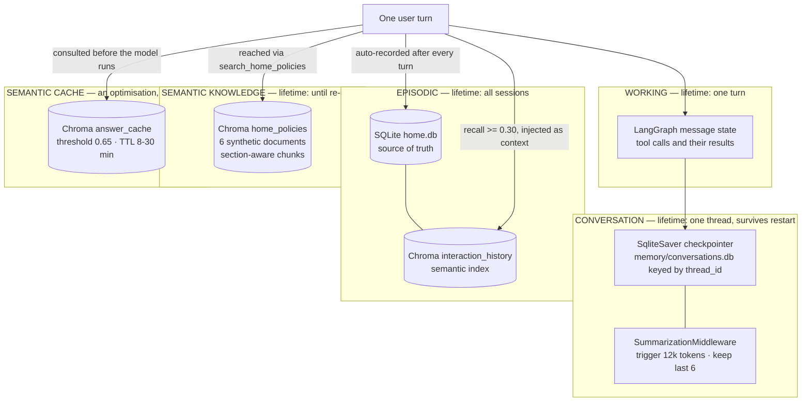

**The cache is drawn separately on purpose.** It reuses the same embedding model and the same Chroma
client, but it is a latency optimisation — not something the agent "knows."

#### How to read Figure 8

1. **Working memory** is the ReAct scratchpad — the tool calls and results accumulating within a
   single turn. It is what lets turn 2 of the model see what the tool returned in turn 1.
2. **Conversation memory** is the SQLite checkpointer, keyed by `thread_id`. This is what makes "what
   about tomorrow?" resolvable, and what makes a correction stick: tell it "my home is actually in
   Minneapolis" and the rest of the conversation uses Minneapolis rather than the saved profile.
3. **Episodic memory** is the record of past task executions, and it spans sessions. Two layers kept
   in sync: SQLite is the source of truth (one row per interaction, queryable by thread and recency),
   and a Chroma collection indexes a short extractive summary so past turns can be recalled
   *semantically* — "what did you tell me about my pipes?" finds the freeze conversation with no
   keyword overlap.
4. **Recording is automatic, not tool-driven.** The orchestrator records every completed turn itself.
   Depending on the model to remember to call a "save this" tool is exactly the kind of thing a weaker
   model silently stops doing.
5. **Semantic knowledge** is the RAG corpus from §9 — a body of reference material, not a record of
   anything the user said. Note that "Clear all memory" deliberately does *not* touch it; rebuilding
   it requires a separate `python ingest.py`.
6. **The episodic summary is extractive, not generated.** It is the question plus the first 300
   characters of the answer. Using an LLM to summarise every turn for memory would add a model call to
   every single interaction for no measurable recall benefit.

| Layer | Holds | Store | Scope | Failure mode if wrong |
|---|---|---|---|---|
| **Working** | Current ReAct loop | LangGraph state | One turn | Agent loses its place mid-chain |
| **Conversation** | Everything said in this thread | `conversations.db` | One conversation, survives restart | Follow-ups stop resolving; corrections do not stick |
| **Episodic** | Every past interaction + tools used | `home.db` + Chroma | All sessions | Noise injected → answers drift to stale topics |
| **Semantic** | Policy corpus | Chroma `home_policies` | Static until re-ingest | **Fabricated rules** — the worst failure in the system |
| **Answer cache** | Recent answers by meaning | Chroma `answer_cache` | 8–30 min TTL | Stale or cross-context answer served |

### The deliberate asymmetry: why episodic does not use the reranker

RAG retrieval is cross-encoder reranked; episodic recall stays on a plain 0.30 cosine threshold. That
inconsistency is intentional and defensible on two grounds:

- **The failure modes differ in severity.** A wrong policy citation is a correctness failure — the
  system states a rule that does not exist. A missed memory costs the user one follow-up question.
  Precision should be bought where it is worth the price.
- **The cost profile differs.** Recall runs on *every single turn*, so it would pay the reranker's
  ~66 ms whether or not any memory exists. Policy retrieval only runs when a policy question is
  asked.

**When recall returns nothing — and why that is silent.** Recall yields nothing in three cases: a
genuinely new topic, an empty or freshly-cleared store, or a turn whose PII was screened (where the
orchestrator skips recall *and* recording entirely). Suppression is invisible to the user by design.
The alternative — passing along a 0.2-similarity memory with a caveat — was tested and reliably
produced answers that drifted toward the old topic.

> **Deletion semantics.** A conversation lives in three places, and clearing only some of them
> produces a confusing half-forgotten state. `forget_thread()` clears the checkpointer *and* the
> episodic rows *and* their vector copies — reading the row ids *before* deleting, so the Chroma
> entries are not orphaned and still turning up in recall. The answer caches are keyed by question
> rather than thread, so they are deliberately left alone and have their own button.

---

## 11. The Advisor: genuine Tree-of-Thought

Where the orchestrator is a ReAct loop, the Advisor is an explicit **beam search**
over a tree of candidate approaches. The distinction that matters at review: the
branches are real objects that get scored, pruned and recorded — not one prompt
asking the model to "consider several options" — and **the winner is chosen by
`argmax` in Python, never by a model call.**

That last point was a defect before it was a feature. Selection used to be a third
LLM call handed the scored options, which meant the scores the interface displayed
and the recommendation the user read **could disagree**, because the model was
free to pick a different one. A comparison the reader cannot trust is worse than
no comparison at all.

**The parameters, all explicit in code** (`agents/beam.py`, `agents/rubric.py`):

| | |
|---|---|
| Branching factor | b₁ = 4 at depth 1, b₂ = 2 at depth 2 |
| Beam width | k = 2 survivors carried forward |
| Depth | **1** in a demo build, **2** in a full build; a turn the Router calls *complex* raises the demo to 2, and never lowers either |
| Pruning | gates (hard) · absolute floor **4.0** · relative floor **3.0** behind the best |
| Budget | 4 LLM calls · 45 s · 8 nodes — the composing call is the caller's, not the search's |
| Rubric | **0.63 of the weight is deterministic or RAG-grounded; 0.37 is the Critic's judgement** |

The depth asymmetry is the "advises, never overrides" rule expressed as a single
`max()`: a Router miss can make an answer *slower*, never worse.

### Figure 9 · Tree-of-Thought pipeline

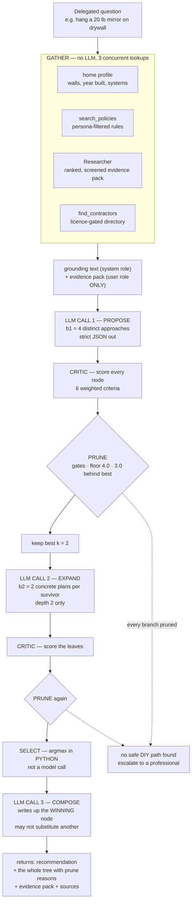

**Gather is concurrent and best-effort.** A failed web search costs the Advisor its citations, not its
recommendation.

#### How to read Figure 9

1. **Gather grounds the reasoning in real inputs before any thinking happens.** Without it the
   branches would be generic internet advice. With it, the options are scored against *this* home's
   wall construction and *this* occupant's role.
2. **The three lookups run concurrently on a thread pool.** The web search is by far the slowest — a
   live network round-trip against a local vector query and a CSV read — so it does not get to
   serialise the other two behind it.
3. **Grounding is best-effort by design.** Each lookup is individually wrapped. A DuckDuckGo failure
   degrades the answer's citations; it does not fail the recommendation.
4. **Propose is forced to emit strict JSON** ("No prose, no markdown"), with a regex-based extractor
   as a second line of defence and a neutral fallback so the pipeline never dead-ends on a malformed
   reply.
5. **The Critic scores against a fixed rubric and cannot move the gates.** Safety risk comes from the
   deterministic hazard table; permission fit must cite a retrieved passage or defaults to neutral. So
   the two criteria that can *rule an option out* are exactly the two the model does not author. The
   Critic supplies suitability, reversibility and effort — 0.37 of the weight.
6. **Selection is `argmax` in Python, and the composing call is told which node won.** It writes the
   winner up; it may not substitute another. Pruned branches travel with the result *including their
   reason*, because a branch discarded invisibly is a branch nobody can question — and a good branch
   killed by a weak evaluation signal is the one failure mode this design cannot detect on its own.
7. **If every branch is pruned, nothing is invented.** The search returns "no safe DIY path found" and
   escalates to a professional. That is a demonstrable behaviour rather than a claim about one.
8. **The persona flows through the whole pipeline** — into the policy filter, into the grounding text,
   into the evaluation criteria, and into the final write-up. A renter and an owner get genuinely
   different recommendations for the same question.

> **Honest trade-off.** Sequential LLM calls are the dominant cost in the system: evaluation case A6
> takes ~49 s against ~12 s for a weather question, and depth 2 adds a further propose/critique round.
> This was accepted rather than optimised away, because collapsing the calls into one prompt would
> destroy the property that makes it Tree-of-Thought — a single prompt asked to "consider options"
> yields a *narration* of reasoning, not an artefact of it. If latency became a product problem the
> right fix is running PROPOSE concurrently with the gather, or caching branches per question class —
> not merging the calls. The depth default already encodes half that trade: a demo build searches
> depth 1 unless the question earns depth 2.

---

## 12. The Cost specialist: auditable arithmetic, LLM presentation

The Cost agent is the clearest illustration of the system's central principle. Every number in its
output is computed in Python. The LLM's entire job is to explain, prioritise, and write it up — and it
is explicitly instructed to use *only* the figures it was given.

### Figure 10 · Cost analysis pipeline

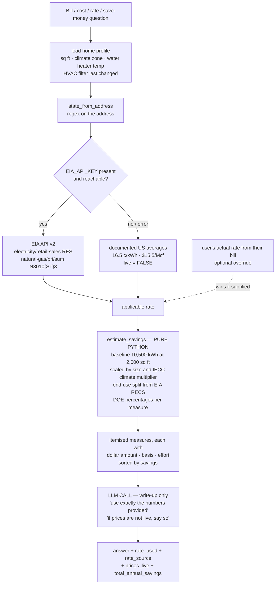

**The user override wins over the live rate.** In a deregulated market the address determines the
delivery utility but not the retail price, so their bill beats any state average.

#### How to read Figure 10

1. **Three tiers of price accuracy, in priority order:** the user's actual rate from their bill, then
   the live EIA state average, then a documented published average. The tier used is always reported
   back.
2. **Degradation is announced, not hidden.** When EIA is unavailable the result carries `live: false`
   and a note, and the prompt requires the model to say so. A silently-stale dollar figure is worse
   than an admitted estimate.
3. **The savings model is transparent arithmetic.** A baseline of ~10,500 kWh/yr for a 2,000 sq ft
   home, scaled linearly by floor area and by an IECC climate-zone multiplier, split into end uses
   using EIA RECS averages, with per-measure percentages from published DOE/ENERGY STAR guidance.
4. **Every measure carries its `basis` string** — e.g. "DOE: ~10 % annual heating/cooling savings from
   an 8-hour daily setback." The agent can state the assumption behind each number, which is what makes
   the figure defensible rather than merely specific.
5. **Some measures are conditional on the home profile.** The water-heater measure only appears if the
   thermostat is above 120 °F; the HVAC filter measure changes wording and percentage depending on
   whether the filter is actually overdue.
6. **The whole result carries an `assumptions` block** stating these are estimates dependent on real
   usage. That text is not decoration — it is what keeps the output honest when it is quoted out of
   context.

> **A field lesson worth telling.** The EIA key initially failed with `API_KEY_INVALID` because a
> capital `I` had been transcribed as a lowercase `l`. Characters `1 / I / l / 0 / O` are confusable in
> most UI fonts. The fix was procedural — verify a key by masked-print plus a live call — and
> structural: `config.py` now `.strip()`s every key so a trailing newline from a paste cannot break
> auth either.

---

## 13. Safety architecture

> Guardrails are enforced in deterministic code, not in prompts — because the language model is the
> least reliable component in the system. A model can be talked out of a soft instruction. A regex that
> runs before the model is even invoked cannot.

### Figure 11 · Guardrail placement

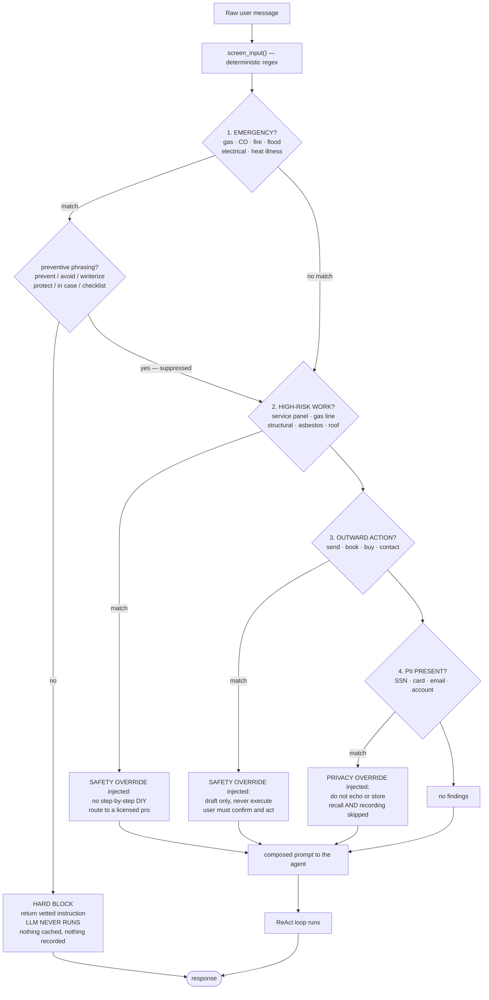

**One guardrail blocks; three steer.** Only a life-safety emergency bypasses the model. The rest become
hard overrides prepended to the prompt.

#### How to read Figure 11

1. **Guardrail 1 is a hard bypass.** Gas, carbon monoxide, fire, burst pipe/flooding, electrical
   hazard, and heat illness each map to a fixed, human-written instruction. The model is never invoked,
   so no amount of model unreliability can degrade the response. It is also never cached and never
   recorded to memory.
2. **The suppressor is the most instructive piece on this diagram.** "How do I *prevent* a burst pipe"
   is the product's flagship use case — and it false-positived as an active emergency. A
   `_PREVENTIVE_CONTEXT` pattern now suppresses emergency detection on preventive or hypothetical
   framing, and case A11 regression-tests it. **The general lesson: always regression-test guardrails
   against your core happy path**, because a guardrail that fires on your main feature is worse than no
   guardrail.
3. **Guardrails 2–4 do not block; they inject.** A high-risk match does not refuse the whole question.
   It appends a `SAFETY OVERRIDE` to the prompt: explain the risk plainly, state that it needs a
   licensed electrician, and cover scope, permits, and how to choose a professional — instead of a DIY
   procedure. The user still gets a useful answer.
4. **The human-in-the-loop guarantee is structural, not behavioural.** The system has *no
   side-effecting tools at all* — nothing that can send, book, or purchase. The override on outward
   actions is belt-and-braces on top of a system that physically cannot act.
5. **PII handling is the strictest path.** A flagged message skips episodic recall *and* episodic
   recording entirely, so nothing sensitive is ever written to a database, and the model is instructed
   not to echo the values back.
6. **Both entry points share this front-half.** `stream_answer()` and `answer_with_trace()` both call
   `_prepare_turn()`, so the CLI, the web app, and the eval suite can never diverge on safety
   behaviour.

**Grounding as a safety property.** Beyond the four screens, the retrieval threshold from §9 is itself
a safety control. When `search_home_policies` returns `grounded: false`, the passages are *dropped
entirely* and the prompt requires the model to say it has no source and to suggest verifying with the
actual HOA, city, or lease. Case A5 — "refuses to invent a rule with no source" — is the most
safety-critical test in the suite.

> **A testing bug that nearly hid a safety failure.** Case A5 false-failed for a while because models
> emit typographic apostrophes — `couldn't` with U+2019 — and the assertion did an ASCII substring
> check. The most safety-critical case in the suite was reporting a failure that did not exist, which is
> exactly the kind of noise that trains a team to ignore a red test. Fixed with a `_normalize()` pass
> folding curly quotes and dashes on both sides. **Always normalise punctuation in assertions over LLM
> output.**

---

## 14. Resilience: every dependency has a fallback

No single external service can take the system down, and the answer always names which source
responded. That last part matters as much as the fallback itself — an answer that silently degraded is
worse than one that says it degraded.

### Figure 12 · Fallback chains

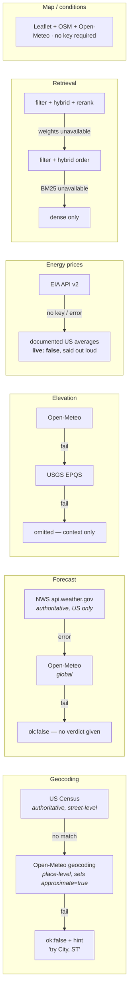

**Note the two chains that end in refusal.** Without a forecast there is no hazard verdict, so the tool
returns an error rather than half-answering.

#### How to read Figure 12

1. **Primary sources are chosen for authority, not availability.** NWS is the only source of official
   US advisories. Census is authoritative for US street addresses. Falling back is a degradation, and
   the answer says which source answered.
2. **Some fallbacks change the answer's meaning, so they flag it.** Open-Meteo's geocoder matches
   *place names*, not street addresses, so a fallback geocode sets `approximate: true` and the answer
   must state that the location is place-level.
3. **Two chains deliberately terminate in failure.** If no forecast can be obtained,
   `check_weather_hazards` returns `ok: false` even though elevation and alerts may have succeeded —
   because there is no hazard verdict to give, and half an answer to a safety question is a liability.
4. **Retrieval degrades in stages, independently.** Losing the reranker costs precision but not
   function. Losing BM25 costs exact-identifier matching. The system falls back to exactly the behaviour
   it had before each stage was added.
5. **The whole application runs with zero API keys.** Every key-gated path has a no-key equivalent.
   This is a deliberate distribution property: a reviewer can clone the repo and run it without a
   billing account.

**Transport-level resilience.** All outbound calls go through one shared pooled `requests.Session`
(`tools/http.py`) with keep-alive and a transport retry policy. Two details worth defending:

- **Retries are transport-only, and deliberately shallow.** `total=1`, `status=0` — 4xx responses are
  *not* retried. A "no data for this point" answer is a real answer, and the tool's own fallback should
  handle it immediately rather than seconds later. The budget was cut from `total=2` after it was
  shown to work against the design: retries **multiply** with the per-call timeout, and the tools are
  *chained* — geocoding tries Census, then Open-Meteo in sequence. At two retries against
  a 20 s timeout, a single unresponsive host cost ~60 s and the full chain could exceed 180 s, which
  is precisely the stall this module's docstring promises not to cause. `HTTP_TIMEOUT` was cut from
  20 s to **8 s** for the same reason: every healthy upstream here answers in well under a second, so
  a long timeout only decides how long a *sick* one blocks a person watching a spinner. Failing fast
  is what lets the fallback chain actually provide the resilience.
- **Connection pooling is a measurable win here.** It replaced 18 call sites that each paid a fresh TCP
  *and* TLS handshake — worse than usual on this machine, where HTTPS is intercepted by a corporate/AV
  proxy that adds its own handshake. The NWS forecast alone needs two calls to the same host.

**Bounded provider fan-out.** The dashboard endpoints wait on several providers at once, and a
timeout on each is not enough on its own. Three rules apply in `api/main.py`:

- **Every wait has a ceiling.** `_settle()` wraps each future with a budget — `DETAIL_TIMEOUT` (20 s)
  for the forecast, `EXTRA_TIMEOUT` (6 s) for elevation, advisories, and the reverse-geocoded label.
  The enrichments are genuinely optional: a dashboard missing an elevation figure is still useful, one
  that never arrives is not.
- **Geocoding is capped as a chain, not per provider.** `_geocode_bounded()` puts a single
  `GEOCODE_TIMEOUT` (12 s) around the whole Census → Open-Meteo sequence, because what a
  person waits on is the total, not any one hop.
- **The pool is shut down with `wait=False`.** This is the subtle one. `with ThreadPoolExecutor(...)`
  calls `shutdown(wait=True)` on exit, so a hung provider holds the request open *even when every
  future has already timed out* — the timeouts would buy nothing. Abandoning the stuck worker is the
  entire point.

> **Environment gotchas that shaped the code.** Two independent services — Wikimedia's `upload.*` and
> the Hugging Face CDN — both reset the connection on a default `python-requests` User-Agent. Both were
> fixed the same way: send a real browser UA and retry with backoff, and degrade gracefully if the
> download never succeeds. The reranker download also writes to a `.part` file and renames on
> completion, so an interrupted transfer can never leave a truncated model that loads successfully and
> then scores nonsense.

---

## 15. Cost and token optimisation

> Seven optimisations, applied in order of leverage. The headline result: 29.0 s → 13.5 s wall clock,
> 36,078 → 14,362 input tokens, and an 11.5× cost reduction on the cached portion of each request.

### 15.1 Reduce the number of model turns *(highest leverage)*

Covered in full in §8. The insight generalises beyond this project and is the one to lead with: in an
agentic system, **latency and token cost are dominated by how many times the model is re-invoked, not
by how much work each tool does.** Every model turn re-sends the entire accumulated message history.
Five turns means the conversation is transmitted and billed five times. Collapsing a six-call chain
into one composite tool removed three model turns and 21,716 input tokens from a single question.

### 15.2 Prompt caching — and why the ordering is load-bearing

Anthropic-family models render a request as `tools → system → messages` and cache by **exact prefix
match**. Mark a cache breakpoint and everything before it can be served from cache on subsequent calls
— at roughly one-tenth the price of a normal input token, and with a shorter time to first token.

**Figure 13 · Request token layout and the cache breakpoint**

```
CORRECT LAYOUT — what this system does

┌──────────────────────┬──────────────────┬─────────┬──────────┬────────────┬──────────┬─────────────────┐
│  12 tool schemas     │  SYSTEM_PROMPT   │ persona │ location │  recalled  │  safety  │ CURRENT         │
│  stable order        │  no timestamps   │         │          │  memory    │ override │ QUESTION        │
│  ~2k tokens          │  no ids  ~1.8k   │         │          │            │          │                 │
└──────────────────────┴──────────────────┴─────────┴──────────┴────────────┴──────────┴─────────────────┘
 ◄──────── CACHED PREFIX, byte-identical every turn ────────►│◄──── VOLATILE, must come after ──────────►
                                          cache breakpoint ──┘


WHAT SILENTLY BREAKS IT

┌──────────────────────┬───────────────────────┬──────────────────┬────────────────────────────────────┐
│  tool schemas        │ "Today is 2026-08-13" │ rest of          │  everything else                   │
│  REORDERED           │  inside the prompt    │ SYSTEM_PROMPT    │                                    │
└──────────────────────┴───────────────────────┴──────────────────┴────────────────────────────────────┘
 ▲ prefix differs by one byte → the ENTIRE cache is missed, every turn, with no error
```

#### How to read Figure 13

1. **The breakpoint covers tools *and* the system prompt together** — roughly 3–4k tokens — because
   tool schemas render ahead of the system block. One marker, two artefacts cached.
2. **All volatile content was already assembled after that point.** Persona, viewed location, recalled
   memory, safety overrides, and the question itself are added in `_compose_message()`, which builds the
   *human* message. That was originally an ergonomic choice; it turned out to be exactly what prefix
   caching requires.
3. **Two specific things would silently disable it:** putting a timestamp or user id inside
   `SYSTEM_PROMPT`, or reordering `AGENT_TOOLS`. Both are documented as warnings at the definition
   sites, because neither produces an error — just a bill.
4. **It is verified, not assumed.** OpenRouter's support for Anthropic `cache_control` was confirmed
   empirically before being relied on: `cache_write_tokens: 3857` on the first call, `cached_tokens:
   3857` on the second, cost **$0.0097 → $0.00084**, an **11.5× reduction**.
5. **Non-Anthropic models get a plain string.** The breakpoint is attached only when the model slug
   contains `claude` or `anthropic`; other providers would reject the content-block form.
6. **The failure is made visible.** `tokens_cached` is surfaced in the Logs tab. If it stays 0 across
   the turns of one question, the prefix is being invalidated — and that is now observable rather than
   merely expensive.

### 15.3 Trim tool payloads that persist

`get_weather_forecast` returned all 48 hourly periods — measured at **1,409 tokens**. That cost
compounds three ways: it is sent once when the tool returns, re-sent on every subsequent model turn in
the conversation, and retained in checkpointed state so it is re-sent again in later turns of the same
thread. The model only ever used min, max, and the humidity at those points. The tool now returns
min/max plus a 6-hourly sample — roughly 250 tokens. The dashboard endpoints call the underlying
function directly and still receive the full series.

> **An optimisation that was deliberately NOT done.** Trimming RAG passages was considered and
> rejected. Measured, they were ~400 tokens total, not the ~1.5k assumed. Truncating them would risk
> citation grounding — the most safety-critical property in the system — for a trivial saving.
> **Measure before optimising, and be willing to publish the optimisation you chose not to make.** It is
> stronger evidence of engineering judgement than the ones you did.

### 15.4 Two-tier answer caching

Covered in detail in §16.

### 15.5 Streaming — perceived latency, not real latency

The graph is consumed with two stream modes at once: `"updates"` for completed messages (which drive
the tool trace and remain authoritative for the final text) and `"messages"` for token-level deltas.
Total time is unchanged; **time to first word went from never — 29 s of blank spinner — to 8.8 s.**

> **The trap that cost a metric.** Enabling `streaming=True` on `ChatOpenAI` *silently drops the usage
> block*, which would have blinded every token count and cache-hit metric in this section.
> `stream_usage=True` is required alongside it. This is a genuinely easy thing to ship without noticing,
> because nothing errors — the numbers just quietly become zero.

### 15.6 Parallelise independent I/O

Applied in four places: the composite hazard tool's three fetches, the Advisor's gather (RAG + web +
contractors), `build_dashboard`, and `/api/weather` — which also folds the reverse-geocode into the
same batch when the caller supplied coordinates without a label. Threads rather than asyncio
throughout, because every one of these is a blocking `requests` call.

### 15.7 Move cold-start cost off the critical path

Graph compilation, SQLite open, the MiniLM embedder load, the BM25 index build, and the one-time 23 MB
reranker download all happen in the FastAPI `lifespan` hook, off the event loop. Best-effort by design:
a warm-up failure must never stop the server booting, because every one of those paths still works on
first use — just slower.

### Summary

| Optimisation | Mechanism | Measured effect |
|---|---|---|
| Composite tool | 6 tool calls → 1; 5 model turns → 2 | **−15.5 s**, −21,716 input tokens |
| Prompt caching | Breakpoint on the tools + system prefix | **11.5× cheaper** on 3,857 tokens/call |
| Payload trimming | 48 periods → min/max + 6-hourly | −1,159 tokens **per turn, compounding** |
| Exact + semantic cache | TTL map + embedding match at 0.65 | 11.7 s → **0.25 s** on repeat or paraphrase |
| Token streaming | Dual stream modes + `stream_usage` | First word at **8.8 s** instead of 29 s |
| Parallel I/O | ThreadPoolExecutor at 4 sites | 3 sequential fetches → 1 fetch's duration |
| Pooled HTTP | One `Session`, keep-alive, transport retry | Removed 18 redundant TCP + TLS handshakes |
| Startup warm-up | `lifespan` + `asyncio.to_thread` | Cold-start cliff off the first question |

---

## 16. Caching strategy

Two caches sit in front of the agent, plus a per-tool TTL cache underneath it. All three are consulted
**after** the safety screen, never before.

### Figure 14 · Cache decision path

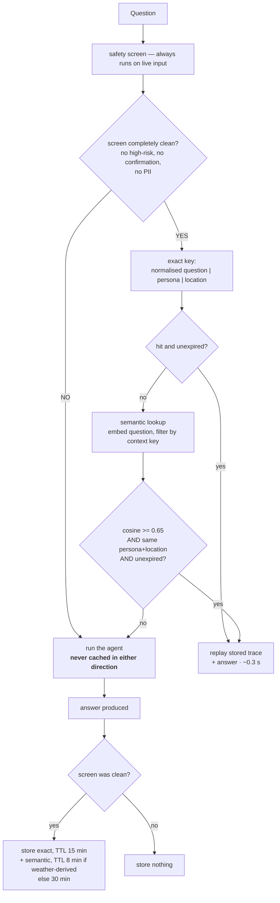

**Persona and location are exact-match identity, never fuzzy.** Only the wording is matched
semantically.

#### How to read Figure 14 — three rules that make this safe rather than merely fast

1. **A high similarity floor.** Serving the wrong answer is far worse than being slow, so 0.65 is
   deliberately conservative and near-misses fall through to a real run. Calibrated against measured
   pairs: 0.796 for "can I put rocks in my backyard instead of grass?", 0.717 for "replace my lawn with
   gravel" — versus 0.454 for "is xeriscaping allowed?", which is *related but not the same ask*. The
   threshold sits in the empty band with ~0.07 margin either side.
2. **Context is identity, not similarity.** Persona and location must match exactly; they are a filter
   on the query, not a component of the score. The same question about a different city is a different
   question, and no amount of wording similarity should override that.
3. **Never reuse an answer across a safety boundary.** The screen's verdict — the hazard category, and
   whether a confirmation gate applied — is part of the entry's exact-match identity, so a guarded
   answer is only ever served back to a question that earns the same guard. Changing the hazard table
   changes the fingerprint, which retires every answer written under the old one rather than replaying
   it under a verdict that no longer holds.

   This rule used to be enforced by refusing to cache guarded questions *at all*, which was heavier
   than the hazard warranted and cost more than it saved. The screen is deterministic and re-runs on
   live input every turn, so the guardrail was never at risk of being skipped — it merely had to be
   *emitted before* the cache could return, and it wasn't. The blanket exclusion was compensating for
   an ordering bug. Its price was permanent: "how do I replace my breaker box myself" is high-risk by
   regex, so the slowest and most expensive class of question in the product was the one class that
   could never be served from cache no matter how often it was asked. Measured on that question:
   183 s cold, 0.2 s on a repeat ask in a *different* conversation.
4. **TTL follows volatility, not convenience.** An answer that leaned on live weather tools expires in
   8 minutes; a policy answer lasts 30. Underneath, per-data-type TTLs run from 30 days for elevation to
   5 minutes for active weather advisories.
5. **Cached answers replay their tool trace.** The UI still shows which tools produced the answer,
   tagged `cached: true`, so a fast answer is not indistinguishable from a hallucinated one.
6. **Failures are not cached.** The tool-level decorator refuses to store any dict carrying
   `ok: false` — a failed lookup should be retried, not remembered.

| Cached data | TTL | Why that number |
|---|---:|---|
| Elevation | 30 days | Ground level does not move |
| Geocoding | 24 h | An address maps to the same point |
| RAG search | 60 min | The corpus only changes on re-ingest |
| Energy prices | 6 h | EIA publishes monthly |
| Air quality | 15 min | Meaningfully variable within a day |
| Full agent answer | 15 min | Long enough for a demo, short enough to stay true |
| Forecast | 10 min | Forecasts update every few minutes |
| Weather alerts | 5 min | **Time-critical** — an expired advisory is a safety issue |

| Scenario | Time |
|---|---:|
| Cold question | 11.7 s |
| Exact repeat | 0.25 s (≈47× faster) |
| Paraphrase | 0.25 s (≈47× faster) |
| Dashboard reload | 0.01 s |

---

## 17. Observability

Every action is recorded as a structured event with a timestamp, a group, a level, and a duration. This
section exists because of a specific problem: an answer took 30 seconds and there was no way to say
where the time went. Now there is — and the answer turned out to reshape the entire optimisation
strategy in §15.

### Figure 15 · Telemetry pipeline

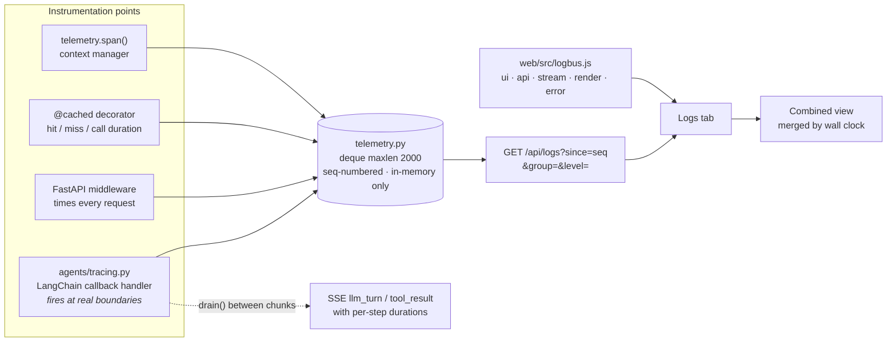

**The callback handler does two jobs.** It writes to the log *and* queues events the orchestrator drains
into the live chat trace — which is why each step shows its own duration.

#### How to read Figure 15

1. **Timings come from callbacks, not from the stream.** By the time a tool result appears in the
   message stream, the work is already over. LangChain callbacks fire at the true start and end
   boundaries, so durations are exact rather than inferred from when a message showed up.
2. **The buffer is in-memory and bounded.** A 2,000-event deque, nothing written to disk. Logging can
   therefore never fill a disk or block a tool call, and there is nothing to gitignore. The trade — logs
   die with the process — is the right one for a demo-scale system.
3. **Clients page by sequence number, not timestamp.** Sequence numbers are unique and monotonic; a
   millisecond-resolution clock lets a poll skip or repeat events when two land in the same millisecond.
   This is a small detail that reviewers who have built log tailers will recognise immediately.
4. **The front-end log stays in the browser.** The interesting client events happen *while* a long
   answer is streaming, and shipping one request per event would distort the very latency being
   measured. The two logs are shown side by side, with a Combined view that merges them by wall clock
   when the question is about the handoff.
5. **Nothing in the handler may raise.** Every method is individually wrapped. A telemetry bug that
   killed a turn would be far worse than a missing log line.
6. **The `/api/logs` path and the chat stream are excluded from request logging.** Polling the log would
   otherwise log itself once a second forever, and the middleware returns as soon as a stream *starts* —
   so its duration would read as a fast request for an answer that took 12 seconds.

> **What observability actually bought.** The first measurement said "the model is ~88 % of the time,"
> which suggested caching and tool tuning were the only remaining levers. Instrumenting *per model turn*
> revealed the real story: it was not one slow call, it was **how many sequential calls the prompt
> demanded**. That reframing produced the composite tool and 15.5 seconds. Aggregate metrics pointed at
> the wrong fix; per-boundary metrics found the right one.

---

## 18. Evaluation

Thirty-three golden cases, all passing, in two layers with deliberately different properties.

### Figure 16 · Two-layer evaluation strategy

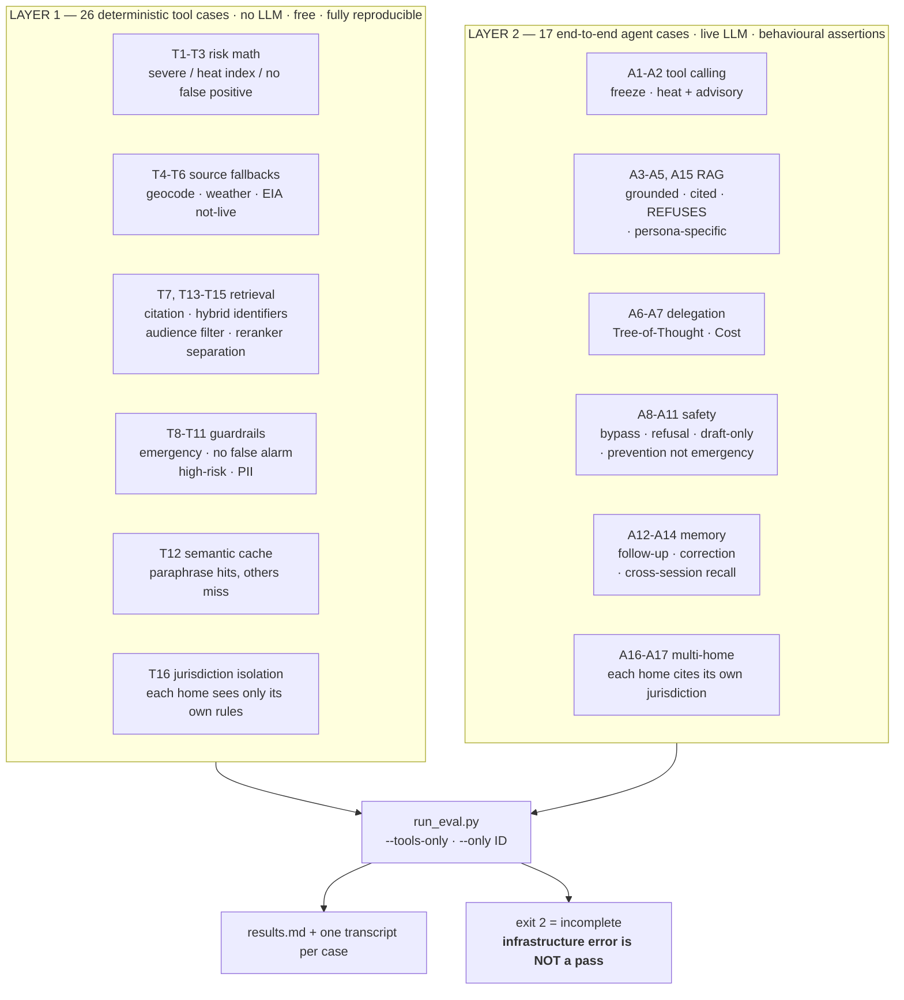

**Layer 1 is the regression backbone** — free, instant, deterministic. Layer 2 is expensive and is run
before releases.

#### How to read Figure 16

1. **Layer 1 costs nothing and runs in seconds** (`--tools-only`), so it can run on every change. Layer
   2 makes real model calls and costs real money, so it runs before a release or a recording.
2. **Assertions are behavioural, not value-based.** A weather case does not assert "the answer says
   34 °F" — it asserts that a deterministic assessor produced the verdict and that the answer quotes its
   level. Otherwise the suite would rot the moment the weather changed.
3. **A not-run infrastructure error is distinguished from a real failure**, and the runner exits 2 for
   "incomplete." A suite that reports green because a case never executed is worse than no suite.
4. **Every case writes a full transcript.** Those transcripts double as the evaluation artefacts a
   review asks for — you can show the actual tool sequence and the actual refusal text rather than a
   green tick.
5. **Cases have per-case thread isolation**, plus `turns` and `seed_memory` support so multi-turn and
   cross-session memory can be tested without contaminating each other. A `persona` field lets a case
   assert persona-specific grounding.

### The most valuable lesson the suite taught: assert outcomes, not mechanisms

Four cases had to be rewritten when the composite tool landed. A13 is the instructive one — it demanded
that `geocode_address` be called, and the composite geocodes *internally*. The behaviour was still
perfectly correct, but the test would have reported a regression on a safe refactor.

The same pattern had appeared earlier: A11 demanded one exact weather tool, and A14 demanded the
`recall_memory` tool in a situation where automatic recall had *already* supplied the memory — a
strictly better outcome that the test scored as a failure. Both were fixed by adding
`expect_tools_any` and `expect_recall` assertions.

> **The suite paid for itself three times.** It caught (1) the model skipping `assess_freeze_risk` when
> the forecast looked obviously warm, (2) the instruction-conflict stall on an approximate geocode, and
> (3) a bug in the harness itself where typographic apostrophes false-failed the most safety-critical
> case. Three real defects, one of them in the test infrastructure — which is exactly the kind of finding
> that justifies having built it.

---

## 19. Frameworks and stack

| Layer | Choice | Role | Why this one |
|---|---|---|---|
| Agent graph | `langgraph` | ReAct state machine, checkpointing, streaming | Owns the loop and the message state; gives SQLite checkpointing and multi-mode streaming for free |
| Agent construction | `langchain.agents.create_agent` | Builds the tool-calling agent | Current API; supersedes the deprecated `create_react_agent`. Accepts a `SystemMessage`, which is what lets the cache breakpoint attach with no middleware |
| Context control | `SummarizationMiddleware` | Compresses history past 12k tokens | Summarises rather than truncates, so an early correction is not silently dropped |
| Model client | `langchain-openai` → OpenRouter | Chat model over an OpenAI-compatible gateway | Makes the model a config value. Default `nvidia/nemotron-3-super-120b-a12b:free`; `nvidia/nemotron-3-super-120b-a12b:free` is a working zero-cost alternative |
| Vector store | `chromadb` | RAG corpus, episodic index, semantic cache | Persistent, embedded, and ships a built-in MiniLM embedder — no embedding API key anywhere in the system |
| Sparse retrieval | in-repo BM25 | Exact-identifier matching | The benefit depends on a custom tokenizer keeping `4.2` and `48-inch` intact — that had to be written regardless; Okapi scoring is textbook |
| Reranking | `onnxruntime` + `tokenizers` | Cross-encoder relevance scoring | Both already arrive with Chroma. Avoids `sentence-transformers` → PyTorch → ~2 GB |
| Conversation store | `langgraph-checkpoint-sqlite` | Thread-keyed state that survives restarts | Zero-ops persistence; connection owned by the app rather than a context manager, since the agent is long-lived |
| API | `fastapi` + `uvicorn` | 26 endpoints, SSE streaming, lifespan warm-up | Native streaming responses and a first-class startup hook |
| Front-end | React + Vite | Dashboard, streamed chat, Logs tab | Needed a real client to render a live SSE trace; Streamlit's rerun model cannot |
| Web search | `ddgs` | Advisor grounding | No key required, keeping the zero-key property intact |
| Legacy UI | `streamlit` | Blocking-path UI | Kept so the blocking entry point has a human consumer, not only the test suite |
| TLS | `pip-system-certs` | Trust the OS certificate store | Required on networks that inspect HTTPS with a private root; harmless elsewhere |

> **A dependency policy, not a dependency list.** Two of these rows are really the same decision: **the
> project must stay clonable and runnable by anyone.** That is why the reranker avoids PyTorch, why BM25
> is in-repo, why embeddings are local, and why every key-gated feature has a no-key fallback. It is a
> distribution constraint that shaped the technical choices — worth stating explicitly, because it
> explains several decisions that would otherwise look like reinvention.

---

## 20. Design principles

These are the rules the codebase actually follows. Each one is traceable to a defect that motivated it.

| # | Principle | Consequence in the code |
|---|---|---|
| 1 | **Safety and numeric judgement live in deterministic code, never the LLM** | Risk bands, savings math, and emergency detection are arithmetic or regex that run regardless of what the model says |
| 2 | **Errors are returned as data, not raised** | Tools return `{"ok": false, …}` so the agent can reason about failure and recover — this *is* the ReAct evidence |
| 3 | **Every external dependency has a fallback, and the answer says which source responded** | Six independent fallback chains; each retrieval stage degrades separately |
| 4 | **The app runs with zero API keys** | Paid providers are enhancements; the reranker avoids PyTorch to keep the repo clonable |
| 5 | **Provenance is preserved in the data, hidden in the UI** | Every chunk carries source, section, audience, jurisdiction — surfaced only as a clean citation |
| 6 | **Caching sits behind the guardrails, never in front of them** | The safety screen always sees live input; nothing that trips a guardrail is ever cached |
| 7 | **Observability must never break the thing it observes** | In-memory bounded buffer; every callback wrapped; front-end log stays client-side |
| 8 | **Assert outcomes, not mechanisms** | Tests check that a deterministic assessor produced the verdict, not which tool chain got there — otherwise a safe refactor reads as a regression |
| 9 | **Never let the model choose its own retrieval filter** | Persona rides the run config. A model can filter itself into an empty result set, and that failure is indistinguishable from "no source exists" |
| 10 | **Calibrate thresholds by measurement, and write the measurements down** | 0.65 semantic cache, −4.0 rerank, 0.30 episodic — each carries its probe table in the source |

---

## 21. Defect log — how the architecture was derived

> Thirty-six defects found, root-caused, and fixed. Read as a set, this is the argument that the design
> is empirical rather than aspirational — and it is the section most likely to win a technical review.

| # | Defect | Fix | Class |
|---|---|---|---|
| 1 | LLM called a 28 °F forecast "no risk" | Deterministic assessors; model forbidden from rating hazards | safety |
| 2 | Model skipped `assess_freeze_risk` when the forecast looked warm | Assessor required even when the answer seems obvious | safety |
| 3 | "How do I **prevent** a burst pipe" triggered the emergency bypass | `_PREVENTIVE_CONTEXT` suppressor + regression test A11 | safety |
| 4 | Conflicting instructions stalled the agent mid-chain | Explicit precedence: finish the task; only safety may cut it short | agent |
| 5 | Eval false-failed on typographic apostrophes (U+2019) | Punctuation normalisation on both sides | test |
| 6 | Over-specified assertions caused flaky failures | `expect_tools_any`, `expect_recall` | test |
| 8 | React white-screened on hover | Tooltip was rendering a condition object; error boundaries added | ui |
| 9 | Floor plan 404 | `` cannot send an auth header — endpoint made public, traversal still blocked | ui |
| 10 | Broken Leaflet marker | `delete L.Icon.Default.prototype._getIconUrl` before `mergeOptions` | ui |
| 11 | A failed turn poisoned thread state | `CURRENT QUESTION` marker + precedence rule | agent |
| 12 | "New conversation" appeared to do nothing | Changed the thread but never cleared the transcript | ui |
| 13 | Stream errors hidden → "(no answer returned)" | Errors surfaced as visible messages | ui |
| 14 | New-chat scrolled the page down | Scroll fired on an empty transcript | ui |
| 15 | History unavailable mid-response | Opens from the already-loaded list | ui |
| 16 | Every question paid full latency | Exact + semantic caching | perf |
| 18 | Autocomplete could not find street addresses | Census one-line address matching with a place-name fallback | ui |
| 19 | Stale test pinned a provider name | T4 asserts fallback *behaviour* | test |
| 20 | Chat rendered markdown as literal text | `Markdown.jsx` + rewritten formatting rules in the prompt | ui |
| 21 | No way to see where 30 s went | Full telemetry + Logs tab | perf |
| 22 | **A weather answer cost 5–7 sequential model turns** | Composite `check_weather_hazards`; 29.0 s → 13.5 s | perf |
| 23 | **48 forecast periods (1,409 tokens) re-sent every turn** | Trimmed to min/max + 6-hourly sample | perf |
| 24 | Whole answer withheld until the turn finished | Token streaming; first word at 8.8 s | perf |
| 25 | **Enabling streaming silently dropped all token accounting** | `stream_usage=True` alongside `streaming=True` | perf |
| 26 | **Owner/Renter toggle had no effect on retrieval** | `audience` metadata filter; persona from the run config | correctness |
| 27 | **"Pet tiger" scored 0.409 > 0.35 → falsely grounded** | Cross-encoder reranking; −8.41 vs −1.25 | correctness |
| 28 | Every tool call paid a fresh TCP + TLS handshake | Pooled `requests.Session` | perf |
| 29 | First question paid graph compile + model loads | FastAPI lifespan warm-up | perf |
| 30 | HF CDN reset the connection on a default UA | Browser UA + retry (same as the Wikimedia 403) | infra |
| 31 | **Vite 8's dev proxy hung ~20 % of API calls** — no error, no retry, no timeout | Browser calls uvicorn directly via `apiUrl()` + `VITE_API_BASE`; CORS already allowed the origins | infra |
| 32 | Session tokens live in memory, so every `--reload` restart silently invalidated the open tab | Swallowed 401s (`.catch(() => {})`) now go through `guard()`, which bounces to the login screen | ui |
| 33 | Switching homes could leave the old home's readings on screen | Request sequencing (`reqSeq`) so only the newest response may write state; dashboard cleared on switch | ui |
| 34 | Mode indicator looked frozen for seconds | It awaited the dashboard refetch while the buttons were disabled; the switch now releases as soon as mode + maps key are updated | ui |
| 35 | **Per-future timeouts bought nothing** — `with ThreadPoolExecutor(...)` calls `shutdown(wait=True)` on exit, so a hung provider still held the request | Explicit `shutdown(wait=False, cancel_futures=True)` | correctness |
| 36 | Transport retries multiplied against a 20 s timeout *across a 3-provider fallback chain* (~180 s worst case) | `total=1`, `HTTP_TIMEOUT` 20 s → 8 s, plus a chain-level `_geocode_bounded()` cap | perf |

### If you only tell three of these stories

1. **#27, the pet tiger.** It is concrete, the numbers are memorable, it explains a real ML concept
   (bi-encoder vs cross-encoder), and the fix is measurably better. Best single story in the deck.
2. **#22, the composite tool.** It shows systems thinking — the bottleneck was control flow, not I/O —
   and it has a hard before/after that was re-measured rather than extrapolated.
3. **#3, the burst pipe.** It shows safety maturity: the guardrail was firing on the product's own
   flagship feature, and finding that required testing guardrails against the happy path rather than
   only against attacks.

**Honourable mention — #31, the proxy.** The best *debugging* story in the set, and the one to reach
for if asked how you isolate a fault. The symptom was "the app randomly takes minutes to load", and
the code was innocent throughout. Three things made it hard: the failure was intermittent (~20 %), the
API was provably healthy, and a hung request produced **no server log at all** because the timing
middleware records after the handler returns — so it looked like a request that never arrived. Two
wrong hypotheses were pursued and discarded on evidence (retry multiplication; proxy keep-alive) before
an A/B against the same endpoint — 20 calls direct versus 20 through the proxy — settled it. The
lesson worth stating out loud: an earlier 8-call sample had passed *by luck*, since at a 20 % failure
rate that happens 17 % of the time. Sample size is part of the diagnosis.

---

## 22. Known limitations

Stating these first is how you keep control of the review. None of them is a surprise; all are scoped.

| Limitation | Impact | Mitigation / path |
|---|---|---|
| **US-only official advisories** | The NWS alerts feed has no international equivalent | Forecast and geocoding already fall back to global Open-Meteo; only the advisory layer is US-bound |
| **Synthetic policy corpus** | Six documents representing no real HOA, city, or lease | The metadata mechanism for real documents exists — chunks already carry a `jurisdiction` field |
| **Jurisdiction-aware document acquisition not built** | Cannot fetch a user's actual municipal code | Designed: lat/lon → state/county/city, targeted fetch from `.gov` and municode-class hosts, jurisdiction-filtered retrieval. Wrong-jurisdiction is the headline hazard, mitigated by a hard metadata filter |
| **SSE coalescing on inspected networks** | The answer arrives in ~6 stages rather than token-by-token | **Traced and confirmed external** — a raw `requests` call straight to OpenRouter shows the same 6 chunks, so it is the TLS-inspecting path, not the code |
| **Reranker requires a one-time 23 MB download** | First run on a fresh clone needs network | Degrades to hybrid order if it fails; pre-warmed at startup so it never lands on a user |
| **Pollen unavailable for some US locations** | No readings from either provider for Dallas | The UI says so explicitly rather than implying a zero reading |
| **Savings figures are modelled, not metered** | Based on typical usage, not the home's actual consumption | Every measure carries its `basis`; the result carries an `assumptions` block; the user's real rate overrides the estimate |
| **Demo auth only** | No real accounts or sessions | Deliberate — the data rule forbids persisting personal information. Token check is real; the user store is intentionally absent |

> **No browser-side key exists.** The map uses Leaflet over OpenStreetMap tiles and every other provider is called server-side, so there is no client key to restrict, leak or rotate. The only credential this build uses is the model key, which never leaves the server.

---

## 23. Review Q&A — likely challenges

**Why an agent at all? Couldn't this be a normal service with a few API calls?**
For the weather path alone — yes, arguably, and that is partly why the composite tool exists: it
collapses that path to nearly a straight pipeline. The agentic layer earns its place on the *routing and
composition* problem. A user asks one question in natural language that may span weather, policy, cost,
and DIY, and the system has to decide which specialists apply, invoke them, reconcile their outputs, and
produce one cited answer. Hard-coding that decision tree would mean enumerating question types in
advance. The honest framing is: the LLM is the flexible front-end to a deterministic back-end, not the
decision-maker.

**How do you know the model isn't just making the risk levels up?**
Structurally it cannot influence them. `assess_freeze_risk` is pure Python with a fixed band table; the
model receives a `level` string and is instructed to report it verbatim. Case T1 asserts the arithmetic
directly with no LLM in the loop; case A1 asserts that the answer quotes the assessor's verdict. The
prompt further forbids the model from concluding "no risk" without the tool — defect #2 in the log is
exactly that failure being caught and closed.

**What stops it inventing an HOA rule that doesn't exist?**
Three layers. Retrieval is filtered, hybrid, and cross-encoder reranked. Passages below −4.0 are
*dropped*, not returned with a low score — so the model gets an unambiguous empty result rather than weak
text it must decide to ignore. And the prompt requires it to say it has no source and suggest verifying
with the actual HOA, city, or lease. Case A5 tests this end to end. Before the reranker, a "pet tiger"
question scored above the grounding threshold; now it scores −8.41 against −1.25 for a genuine match.

**Your retrieval has three stages. Isn't that over-engineered for six documents?**
Each stage closed a specific observed defect, not a hypothetical one. The filter closed a correctness bug
where renters were grounded on owner-only covenants. BM25 closed the exact-identifier gap that citations
depend on — embeddings blur `CC&R 4.2` and `48-inch`. The reranker closed the false-grounding bug.
Measured overhead is ~0.04 ms and ~66 ms respectively, against a ~10 s answer. And each stage degrades
independently, so complexity does not translate into fragility. The corpus size is small today; the
failure modes are not size-dependent.

**Why regex for safety instead of an LLM classifier or a guard model?**
Because the model is the least reliable component in the system, and a guard model would add another one.
Regex is deterministic, auditable line by line, adds no latency, costs nothing, and — critically — *runs
before the model is invoked at all*, which is what makes the emergency bypass a real bypass. The trade is
recall: regex will miss creative phrasings. That is an accepted, documented residual risk. It is also why
the guardrails are a screen in front of a system that has no side-effecting tools, rather than the only
thing standing between a user and an action.

**The emergency path bypasses your entire system. Isn't that a single point of failure?**
It is a single point of *control*, deliberately. In a life-safety situation the least reliable possible
responder is a probabilistic model. The bypass returns fixed, human-written text — "leave the building, do
not flip switches, call 911 from outside" — that cannot be degraded by a bad model day, a rate limit, or a
prompt injection. The genuine risk is the opposite one: *false positives*, which is exactly defect #3, and
which is why the preventive-context suppressor and case A11 exist.

**You cache answers. How do you guarantee a stale forecast is never served?**
Three controls. TTL is volatility-aware — an answer whose trace includes any live weather tool expires in
8 minutes rather than 30, and the underlying alerts cache is 5 minutes. Location and persona are
exact-match identity, so a cached answer can never cross to a different place. And anything that tripped a
guardrail is never cached in either direction. The residual window is bounded by the 8-minute TTL, which is
a documented trade against re-running a 13-second answer for every repeat during a demo.

**What happens when OpenRouter is down or the model is rate-limited?**
The stream yields a typed `error` event that the UI renders as a visible message rather than an empty
bubble — that was defect #13. The dashboard is unaffected because it does not go through the agent, so live
weather, hazard ratings, and advisories keep working with no model at all. And `python main.py --demo` runs
the full deterministic hazard pipeline with no API key whatsoever. The degraded state is "no conversational
layer," not "no product."

**Prompt caching sounds fragile. How would you know if it broke?**
That was the exact concern, and it is why `tokens_cached` is a first-class metric in the Logs tab rather
than an implementation detail. If it reads 0 across the turns of one question, the prefix is being
invalidated. The two realistic causes — a timestamp or user id inside `SYSTEM_PROMPT`, or a reordered
`AGENT_TOOLS` list — are documented as warnings at both definition sites. It is worth being explicit that
this failure produces no error at all; it just quietly costs 11.5× more. Instrumentation is the only
defence.

**Why is persona not just a tool argument? That seems simpler.**
Because the failure mode is invisible. A model that picks its own metadata filter can filter itself into an
empty result set, and an empty result set is indistinguishable from "no source exists for this" — which is
the one answer this system must never give wrongly. The UI already knows the persona with certainty, so it
rides the run config and the tool reads it via `get_config()`. The model is not given the opportunity to get
it wrong. Case T14 asserts both directions of the filter.

**Three LLM calls for one DIY question is expensive. Justify it.**
It is the most expensive path in the system — ~49 s against ~12 s — and it was accepted rather than
optimised, because collapsing branch/evaluate/select into a single prompt destroys the property that makes
it Tree-of-Thought. A single prompt asked to "consider several options" produces a narrated conclusion;
three calls produce a real option tree with scores that the user can see and disagree with. If latency
became a product problem, the right fix is running BRANCH concurrently with gather, or caching branches per
question class — not merging the calls.

**How would you take this to production?**
Four things, in order. **Persistence:** SQLite and an embedded Chroma are single-process assumptions — move
to Postgres plus a managed vector store, and the checkpointer swaps behind the same interface.
**Identity:** replace demo auth with real accounts, which then requires the PII posture to become
data-retention policy rather than a "persist nothing" rule. **Observability:** the in-memory ring buffer is
right for a demo and wrong for production — the event shape is already structured, so it exports to any
sink. **Corpus:** the jurisdiction-aware acquisition pipeline in §22, where the primary hazard is serving a
rule from the wrong jurisdiction and the mitigation is the hard metadata filter that already exists.

**What is the weakest part of this system?**
The corpus. Every retrieval mechanism above it is sound and tested, but it is grounded on six synthetic
documents, so the system's real-world usefulness for policy questions is currently a demonstration rather
than a capability. Second weakest is the safety screen's recall — regex will miss phrasings it has not seen,
and the mitigation is architectural (no side-effecting tools) rather than detection-based. Both are known,
scoped, and in §22 rather than being discovered in this room.

---

### Closing frame for the presentation

If the panel remembers one sentence, make it this: **the language model in this system routes, retrieves,
and explains — it does not decide.** Every hazard level, every dollar figure, and every emergency response
is produced by deterministic code that runs regardless of what the model says. That constraint is what made
the system testable with 42 evaluation cases, auditable in its numbers, and safe enough to put in front of
someone standing in their house at 2 a.m. wondering if their pipes are about to burst.

---

## 24. The forecaster speaks first

A forecaster that only answers when asked is a search box. Everything else in
this system responds to a question; this is the one surface that starts the
conversation. When freeze or heat reaches `moderate`, or any official advisory is
active for the resolved location, a dialog appears with the level, the headline
and the actions — unprompted.

### Why the text is deterministic

The obvious implementation asks the model to write a tailored warning. That was
rejected, and the reasoning is the same one that keeps hazard *levels* out of the
model's hands, only stronger — because here nobody asked for the text and nobody
is waiting to judge it.

| | deterministic | model-written |
|---|---|---|
| Latency | instant | **6–100 s** measured on the free tier |
| Cost | zero, so it can run on every load forever | one call per dashboard load |
| Failure mode | none — the text is fixed | an invented precaution, on the one surface that speaks unprompted |

A warning that arrives after the user has moved on is not a warning. Sources are
`assess_freeze_risk`, `assess_heat_risk` and `tools/home_precautions.py`. The
tailored answer is one click away instead: **Ask the assistant** prefills the chat
and focuses it but **never sends** — the notification decides something is worth
asking; the person decides to ask.

### What an advisory means for the building

The National Weather Service says how to keep *people* safe and stops there,
because protecting the building is not its job. That gap is this product's whole
subject: relaying *"Heat Advisory — stay hydrated"* repeats the radio.

`tools/home_precautions.py` maps advisory type to home actions — disconnect hoses
before a freeze, latch the garage door before a wind event, move valuables off
basement floors before a flood. It is attached in `tools/alerts.py`, so **the
agent reads the same field the UI does**; a second definition in the front end
would drift from the first within a month.

Official guidance and home actions are shown **separately and never merged**: one
is quoted from an authority, the other is ours, and blurring that would attribute
our advice to them. An unrecognised event yields **nothing** rather than filler —
advice that fits any hazard tells the reader nothing and costs the specific
advice its credibility.

### Two properties that are easy to get wrong

**Dismissing is not silencing.** Dismissals key on the *condition*, not the
notification, so dismissing `freeze: moderate` cannot mute the `freeze: severe`
that arrives an hour later. Silencing an escalation is the one thing a hazard
notification must never do. A dismissed alert collapses to a pill stating how
many remain active, so the way back is always visible.

**It renders through a portal.** Leaflet builds its own stacking context with
panes and controls up to `z-index: 1000`, so the dialog first rendered
*underneath the map*. Raising the number would beat today's map and lose to the
next component with an opinion — and cannot fix the other half of the problem at
all, since any ancestor with a `transform` traps a fixed-position child
regardless of z-index. Portalling to `document.body` leaves both arguments.


---

## 25. The Researcher, and untrusted text

Replaces the raw single search call that gave the model **four results truncated
to 160 characters each** — 640 characters total, from which it was expected to
reason about load ratings and building practice.

    plan → fan out → merge + dedupe → screen → rank → pack

Query planning is **templates, not a model**: three variations cover what this
product actually asks — the question as posed, the question grounded in the home's
construction, and the question aimed at primary sources — and a fourth model call
per turn is real latency on a free model for a gain nobody could measure.

Ranking is `0.60 × relevance + 0.25 × authority + 0.15 × position`, where
relevance comes from the cross-encoder already loaded for RAG (no new dependency,
and the same model that decides whether a policy passage is grounded) and
authority from a static, auditable domain table.

### The `site:` finding

Appending the **text** `"energy.gov guidance"` to a burst-pipe query returned
**zero** energy.gov pages across twelve results. `site:energy.gov` on the same
question returned energy.gov **three times out of three**.

**A qualifier is a hint the engine may ignore; `site:` is a filter it cannot.**

This mattered beyond tidiness. Free-tier search returns almost entirely unrated
SEO pages, so the 0.25 authority term had nothing to discriminate on and ranking
was effectively relevance-only. The demo was showing the pipeline while quietly
not showing what the pipeline is *for*.

One restricted query is added *alongside* the unrestricted ones — last, so
tightening the query budget drops it first, and never instead of them, so a site
filter that finds nothing cannot empty the pack.

A caveat worth stating, because it is easy to get wrong: **a query operator is
one provider's dialect, not a portable interface.** `site:` is a DuckDuckGo idiom.
A provider that parses queries semantically rather than lexically can be actively
harmed by it, so query planning has to know which provider it is planning for.

### Two gates the ranking did not have

**A relevance floor.** `search_home_policies` refuses below
`MIN_RERANK_SCORE = -4.0`. Research had no equivalent: `rank_passages` sorted and
took the top six, and nothing could empty a pack. Measured on *"do I need a permit
to replace my water heater?"* against the frozen snapshot — which is exactly what
a grader re-running this repository sees:

| ref | raw cross-encoder score | domain |
|---|---|---|
| E1 | −10.93 | facebook.com |
| E2 | −10.88 | reddit.com |
| E3 | −11.26 | docs.nrel.gov |
| E4 | −11.25 | codes.iccsafe.org |

Every passage roughly seven points below the floor retrieval refuses at, and all
of them handed to the model as evidence. `_normalise` min-maxes into 0..1
**before** ranking, so E1 reported `relevance 0.88` on a raw score of −10.93: a
pack in which nothing was relevant was indistinguishable from one in which
everything was.

**This project's claim is cite-or-refuse. Retrieval refused; research did not** —
and the gap was invisible precisely because the normalised number looked healthy.

The floor now applies to the **raw** score and reuses the retrieval constant
rather than inventing a second one: same cross-encoder, same scale, and two
thresholds for one model drift apart the moment either is tuned. It is
deliberately **not** applied when the reranker is unavailable — there is no score
to apply it to, and refusing everything because a model failed to load would turn
a degraded ranking into no evidence at all.

That permit question now returns an empty pack, and the answer cites nothing
rather than citing five sources about something else.

**A per-domain cap on passages.** `providers.dedupe` caps *results* per domain,
which is the same thing only while a provider returns snippets — one snippet
yields exactly one passage. It stops being the same thing when a provider returns
page content, because two results from one site can split into as many as eight
passages, and a model reads that as several independent sources agreeing. This
gate therefore guards a configuration **this demo does not ship**: its free
provider returns snippets. It is here because the failure is silent, and because
a cap that only appears once someone changes provider is a cap nobody remembers
to add.

Both gates record a **reason**, so a passage screened out for irrelevance is as
visible as one screened out for being hostile — and `research.no_relevant_evidence`
is logged at warn level when a pack empties. "The search found nothing" and "the
search worked and none of it was about the question" look identical from the
outside and are completely different faults.

### R14 — prompt injection, five layers

Ordered by how much each actually protects, because the ordering is the argument:

1. **Fetched text never enters a `SystemMessage`.** Structural, mechanically
   checkable, and the only layer that is a genuine control rather than a hope.
   The grounding text and the evidence block are two separate functions rather
   than one with a flag *for this reason*.
2. **Delimited and banner-wrapped**, with delimiter lookalikes escaped, so a page
   cannot close the block and start issuing instructions outside it.
3. **A detector drops and logs** — nine patterns, invisible and bidirectional
   characters, long base64 blobs. Deliberately the *least* load-bearing layer:
   pattern matching against adversarial text is a losing game played alone, and
   treating it as the primary defence is how a system ends up trusting a page
   because it did not say "ignore previous instructions".
4. **Citations are resolved in Python.** The model writes `[E3]`; a fabricated
   `[E9]` renders as `[unknown source]` rather than a plausible link. This also
   catches ordinary citation invention, not just hostile pages.
5. **No side-effecting tool exists to reach.** Every tool is read-only, so a
   successful injection achieves bad prose at worst — which the deterministic
   safety screens still override.

### Research fixtures

`SHF_RESEARCH_FIXTURES` serves a frozen snapshot instead of the live web. **Off by
default** — live evidence is the Researcher's whole purpose. It exists for the two
cases where the live web is a liability: a graded run, which must give a grader
the same answer months later, and a recording, where a rate-limited scrape ruins
the take. The free search path is a scraper, not an API, which is why a sticky
rate-limit flag exists at all.

It intercepts at `providers.search`, the single network boundary, so fixture
results still flow through the real dedupe, injection screen, cross-encoder
ranking and pack builder. Freezing the finished evidence pack would have been
easier and would have tested nothing.

Fixture mode is **exclusive, not a preference with live fallback** — a fallback
would mean a stale snapshot silently became a live search, and the run would look
reproducible while not being it. A missing fixture **raises**, because an empty
list is indistinguishable from a working search that found nothing.

### The evidence panel

The Researcher used to be the only agent whose work reached no surface at all:
citations appeared inline in the prose, and everything else — which queries ran,
which pages were screened, why a pack came back empty — reached nothing but the
Logs tab. `web/src/components/EvidencePanel.jsx` is the counterpart to the
reasoning tree and exists for the same reason. That panel shows *options*
considered and ruled out; this one shows *sources* considered and ruled out.

It carries three claims the system makes about itself and could not otherwise
evidence: a hostile page was **dropped** rather than merely ranked low; an empty
pack was a **judgement** rather than a failure; and no single site owns the pack,
so apparent corroboration is real. Authority is shown as its **label**, never its
number — "manufacturer" is a claim a reader can dispute, while "0.90" invites
trust in a weight they have no way to check.
