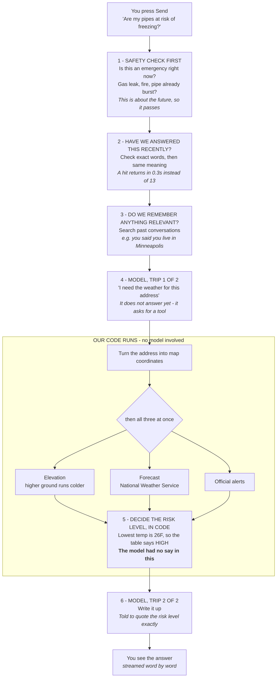
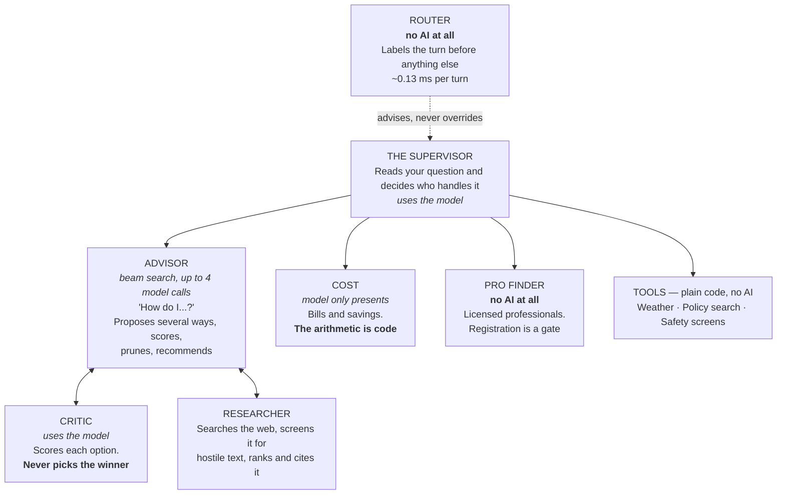
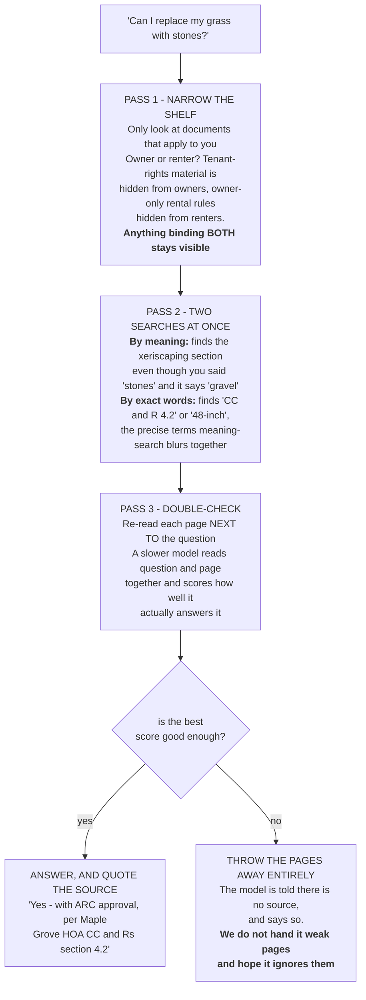
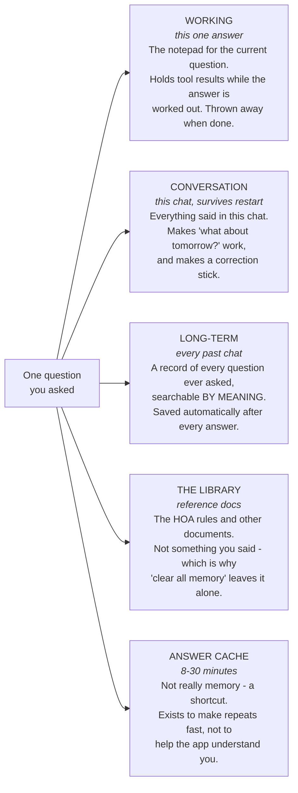
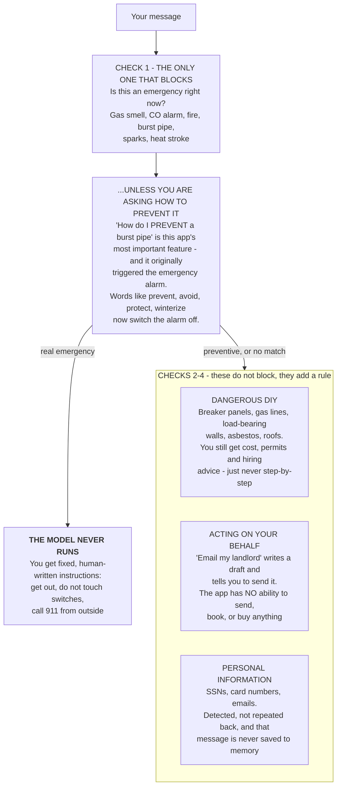

# How the Smart-Home Forecaster works

> An app that watches the weather at your house and warns you before your pipes freeze — and
> can also tell you whether your HOA lets you rip up the lawn. This page explains how it does
> that, from the top, assuming nothing.

**Who this is for:** anyone who wants to understand this system without already knowing what
RAG, ReAct, or a vector database is. Every term gets explained before it gets used. If you
want the deep version with the measurements and trade-offs, read
[`architecture-review.md`](architecture-review.md) instead.

An interactive version of this page is at [`how-it-works.html`](how-it-works.html).

---

## Contents

1. [What it actually does](#1-what-it-actually-does)
2. [The one big idea](#2-the-one-big-idea)
3. [Words you'll need](#3-words-youll-need)
4. [One question, start to finish](#4-one-question-start-to-finish)
5. [The team of specialists](#5-the-team-of-specialists)
6. [Looking things up in documents](#6-looking-things-up-in-documents)
7. [How it remembers](#7-how-it-remembers)
8. [How it stays safe](#8-how-it-stays-safe)
9. [How it was made fast](#9-how-it-was-made-fast)
10. [How we know it works](#10-how-we-know-it-works)
11. [Where things live in the code](#11-where-things-live-in-the-code)
12. [Run it yourself](#12-run-it-yourself)
13. [Questions you might have](#13-questions-you-might-have)

---

## 1. What it actually does

You type a question in plain English. You get back a specific, useful answer about *your*
house — with a note saying where the information came from.

Four kinds of question work:

| You ask | It answers |
|---|---|
| "Are my pipes going to freeze this week?" | A risk level and exactly what to do tonight — drain the outdoor spigots, open the cabinet doors under the sink |
| "Can I replace my grass with stones?" | Yes or no, quoting the actual section of your HOA rules that says so |
| "How do I hang a 20 lb mirror?" | Several approaches, scored against your wall type, with the best one recommended |
| "How can I lower my power bill?" | A list of changes with real dollar amounts, using live electricity prices for your state |

### Why can't ChatGPT just do this?

It genuinely can't, and the reason is worth understanding because the whole design flows from
it. A language model on its own has **four specific gaps**:

- It doesn't know your address.
- It doesn't know today's weather — its knowledge is frozen at whenever it was trained.
- It has never seen your HOA's rulebook.
- It has no way to check whether anything it just told you is true.

So this system's job is to close those gaps: give the model a way to look up real data, real
documents, and real prices — and then *constrain* what it's allowed to decide on its own.
That last part is the next section, and it's the most important idea here.

---

## 2. The one big idea

> **The language model routes, retrieves, and explains. It does not decide.**

Every number that matters in this app — the freeze risk level, the dollar savings, whether
something counts as an emergency — is calculated by ordinary Python code. Boring,
predictable, testable code. The model never gets a vote.

Here's the actual bug that led to this rule:

> ### ⚠️ The bug that shaped everything
>
> Early on, the model was shown a forecast with a low of **28°F** — well below freezing — and
> it confidently reported **"no risk."** It wasn't lying. It just isn't reliable at that kind
> of judgement, and there's no way to make it reliable through wording alone.
>
> The fix wasn't a better prompt. It was to take the decision away from it entirely. Now a
> function called `assess_freeze_risk` looks at the temperature and returns a level from a
> fixed table: at or below 20°F is **severe**, 28°F is **high**, 32°F is **moderate**, 36°F is
> **low**. The model is only allowed to *repeat* what that function said.

> ### 💡 Think of it like this
>
> The model is a very well-read receptionist. Brilliant at understanding what you're asking,
> knowing who to route you to, and explaining the answer back to you in plain language.
>
> But you would not let the receptionist read your X-ray. You send that to the machine that
> measures things, and the receptionist reads you the result.

Keep this in mind for the rest of the page. In the diagrams below, **the code that decides**
and **the model** are labelled separately. You will notice how little the model does.

---

## 3. Words you'll need

Nine terms. Read these once and the rest of the page will make sense. Come back if a word
stops making sense later.

| Term | What it means |
|---|---|
| **Language model** | The AI that reads and writes text — the "GPT" or "Claude" part. *In this app it's reached over the internet through a service called OpenRouter, so the specific model is just a setting we can change.* |
| **Prompt** | Everything we send the model: the instructions, plus the user's question. *This app's instruction block is about 1,800 words. It's basically the job description.* |
| **Token** | How text gets chopped up for the model — roughly ¾ of a word. Everything is billed and measured in tokens. *"Are my pipes at risk?" is about 7 tokens.* |
| **Tool** | A normal function we let the model call — like `get_weather_forecast`. *The model can't run code. It replies "please call this function with these arguments," our code runs it, and we hand back the result.* |
| **Agent** | A model in a loop with tools. It thinks, calls a tool, sees the result, thinks again — until it has enough to answer. *That loop is the difference between a chatbot and an agent.* |
| **ReAct** | The name of that loop: **Rea**son, then **Act**, then observe, then repeat. *It ends when the model replies with words instead of a tool request.* |
| **Embedding** | Text turned into a list of numbers that captures its *meaning*. Similar meanings produce similar numbers. *This is what lets "put rocks in my yard" find a document about "xeriscaping" with no words in common.* |
| **Vector database** | A database that stores embeddings and can find the closest matches fast. *This app uses one called Chroma, which runs inside the app — no server to set up.* |
| **RAG** | **R**etrieval-**A**ugmented **G**eneration. Fancy name, simple idea: before answering, go find relevant documents and paste them into the prompt. *That's it. Section 6 shows how this app does it.* |

---

## 4. One question, start to finish

Let's follow a real question all the way through: **"Are my pipes at risk of freezing in the
next two days?"**

### Figure 1 · What happens after you press Send



**Notice how little the model does.** Two short trips: one to say what it needs, one to write
the answer. Everything factual happened in between.

#### The parts worth understanding

1. **Safety runs before everything, on your live words.** If it ran after the cache, we could
   serve you a saved answer for a message that *this time* says "there's a gas leak." Order
   matters.
2. **The cache checks meaning, not just spelling.** "Can I put rocks in my backyard?" and "Am
   I allowed to replace my grass with stones?" are treated as the same question. But only if
   the location and your role match exactly — the same words about a different city are a
   different question.
3. **The three weather lookups happen simultaneously.** Once we know the coordinates,
   elevation, forecast, and alerts don't depend on each other. Running them at the same time
   costs one lookup's worth of waiting instead of three.
4. **Step 5 is the whole philosophy in one box.** A plain function looked at 26°F and returned
   "high." No AI. That's why the answer is trustworthy.
5. **Two model trips, not seven.** This used to take five separate trips and 29 seconds,
   because the model had to ask for each piece of data one at a time. Section 9 explains how
   that was fixed.

---

## 5. The team of specialists

That last example only used the weather path. But questions vary a lot, so the system is
built like a small team: a **supervisor** reads your question, decides who should handle it,
and combines the results if more than one applies.

### Figure 2 · Who handles what



**Seven agents, and three never use AI at all** — the Router, the Pro Finder, and
the whole control half of the Advisor.

**Weather, policy search and the safety screens are tools, not agents**, and the
distinction is not pedantry. An agent is something that can be *wrong in a way
nothing else catches*. Looking up a forecast cannot be wrong that way — it either
returns the forecast or it fails visibly. Calling those "specialists" would
inflate the count while hiding the interesting claim: most decisions here are
made by ordinary code.

**The Critic scores but never selects.** The winner is chosen by `argmax` in
Python. Separating those two jobs is what stops the system quietly recommending
something other than what the displayed scores say.

#### The parts worth understanding

1. **Routing is written down, not learned.** The supervisor's instructions literally say: *if
   the question mentions a bill, cost, rate, or saving money, always use COST.* That rule
   exists because without it, money questions went to the Advisor and came back with no dollar
   figures in them. The Router adds a second, cheaper opinion in front of that — but only ever
   as a hint.
2. **The Router runs on every single turn, so it cannot cost anything.** Including the turns
   that hit the cache and never reach a model at all. A router that costs a model call is one
   you cannot afford to run *before* deciding whether to spend a model call. It matches known
   phrases and compares your sentence to example questions — no AI, about a tenth of a
   millisecond.
3. **The Advisor is the expensive one.** It *searches*: proposes four approaches, scores them,
   discards the ones that break a rule, then develops the two that survive. Up to four model
   calls plus one to write the answer. A weather question takes ~12 seconds; an Advisor
   question takes ~49.
4. **Why a search instead of one call?** Ask a model in a single prompt to "consider several
   options and pick the best" and you get a conclusion with reasoning written around it.
   Searching produces a genuine list of options with scores you can see and disagree with — and
   the winner is chosen **by code**, so the recommendation cannot quietly differ from the
   scores on screen.
5. **One question can use two specialists.** "It's going to freeze — can I run a space heater
   in the garage under my lease?" needs the weather tools and the policy search, and the
   supervisor merges both into one answer.

---

## 6. Looking things up in documents

This is the RAG part. The app has a small library — HOA rules, a city permit checklist,
short-term-rental rules, a renter policy, a freeze-prevention guide, an appliance care guide.
When you ask "am I allowed to…", it searches that library and answers *only* from what it
finds.

> ### 💡 Think of it like this
>
> Imagine a librarian who is not allowed to answer from memory. You ask a question, they walk
> into the stacks, come back with three pages, and read you the relevant part — and if they
> can't find a page that answers it, they say *"we don't have anything on that,"* rather than
> guessing.
>
> That refusal is the most important behaviour in this whole section.

### Searching happens in three passes

#### Figure 3 · Three passes, narrowing each time



**Pass 3 is the one that stops it making things up.** The story below is the clearest example
in the whole project.

### The pet tiger

Someone tested the app with a deliberately silly question: **"Am I allowed to keep a pet tiger
in my backyard?"**

There is obviously nothing about tigers in the HOA rules. But the search returned the
landscaping section with a confidence of **0.409** — and the cutoff for "good enough to answer
from" was **0.35**. It passed. The app was one step away from inventing an HOA rule about
tigers.

Why did that happen? Because of *how* the fast search works:

> ### 💡 Think of it like this
>
> The fast search reads the question and the page **separately**, turns each into numbers, and
> checks whether the numbers are close. It's really asking *"are these two things about
> similar stuff?"*
>
> Both mention a backyard. So: yes, similar stuff. It was never asking the question that
> actually matters — *"does this page answer this question?"*
>
> Pass 3 uses a slower model that reads the question and the page **at the same time**, so it
> can answer that second question properly. It's too slow to read the whole library this way,
> which is why it only re-reads the handful of pages the fast search already found.

| Question | Fast search | Careful re-read |
|---|---|---|
| "Replace grass with stones" — genuinely in the rules | 0.498 ✅ | −1.25 ✅ |
| "Keep a pet tiger" — not in the rules at all | 0.409 ❌ *passed!* | −8.41 ✅ *rejected* |
| **Gap between them** | **0.09** — far too close to call | **7.16** — no contest |

The scores look odd because the two methods use completely different scales — don't try to
compare across the columns. What matters is the *gap within each column*. The fast search put
a real match and a nonsense match 0.09 apart, straddling the cutoff. The careful re-read put
them 7 points apart, with a wide empty band in between where a cutoff can safely sit.

---

## 7. How it remembers

Language models have no memory between messages. Every request starts from nothing. So if you
want a real conversation, you have to build memory yourself — and this app has four different
kinds, because they solve different problems.

### Figure 4 · Four kinds of memory



**They're separate because they fail differently.** Bad long-term recall gives you a slightly
off answer. A broken library invents fake HOA rules.

#### The parts worth understanding

1. **Old messages get summarised, not deleted.** Once a conversation gets long, older parts are
   compressed into a summary while the last six messages are kept word for word. If we just
   chopped off the old ones, a correction you made early would silently vanish.
2. **Weak memories are ignored completely.** A past conversation only gets pulled in if it's
   genuinely relevant. Below that bar, nothing is added and the model is never even told a weak
   match existed — because passing along a barely-related memory "with a caveat" reliably drags
   the answer toward the wrong topic.
3. **Anything time-sensitive is re-checked.** The model is explicitly told that a remembered
   forecast is stale and must be looked up again. Memory is for what you *said*, not for what
   the weather *was*.
4. **Deleting a chat cleans up all three places it lives.** The conversation file, the
   long-term record, and the search index. Clearing only some of them leaves the app in a
   confusing half-remembering state.

---

## 8. How it stays safe

This app gives advice about gas, electricity, water, and heat — things that genuinely hurt
people. So there are four checks, and they all run **before** the model sees your message.
They're written as pattern-matching rules in plain code, not as instructions in the prompt.

> **Why not just tell the model to be careful?**
>
> Because a model can be talked out of an instruction, and it doesn't behave identically every
> time. Code that runs before the model is even called can't be argued with. When something is
> genuinely dangerous, you want the boring guarantee.

### Figure 5 · Four checks, one of which stops everything



**The suppressor is the lesson worth remembering.** A safety check that fires on your main
feature is worse than no safety check.

There's a fifth safety property that isn't a check at all: **the app cannot do anything in the
real world.** There is no code anywhere in it that sends an email, books an appointment, or
spends money. Even if every other guardrail failed, the worst outcome is bad text on a screen.

---

## 9. How it was made fast

A weather question used to take **29 seconds**. It now takes **13.5**. The fix is a genuinely
useful lesson about how these systems behave.

### The thing that was slow wasn't what anyone expected

The obvious suspect was the internet lookups — weather, elevation, alerts. But those take
milliseconds. The real cost was **how many times we had to go back to the model**.

Remember the ReAct loop: the model asks for one tool, sees the result, then decides what to
ask for next. It can't ask for the second thing until it's seen the first. So getting five
pieces of data meant five separate round trips, each taking several seconds.

> ### 💡 Think of it like this
>
> You're cooking, and you send someone to the shop for one ingredient at a time. They walk
> there and back for the flour. Then again for the eggs. Then again for the butter.
>
> The shop isn't far. *The walking is the problem.* The fix isn't a faster shop — it's writing
> one list.

### Figure 6 · Before and after

```mermaid
flowchart TB
  subgraph BEFORE["BEFORE - 29 seconds"]
    b1["Model: 'what's the address?'"] --> b2["look up profile"]
    b2 --> b3["Model: 'coordinates?'"] --> b4["look up coordinates"]
    b4 --> b5["Model: 'elevation?'"] --> b6["look up elevation"]
    b6 --> b7["Model: 'forecast?'"] --> b8["look up forecast"]
    b8 --> b9["Model: 'any alerts?'"] --> b10["look up alerts"]
    b10 --> b11["Model: writes the answer"]
  end

  subgraph AFTER["AFTER - 13.5 seconds"]
    a1["Model: 'check the hazards here'<br/><i>one request instead of five</i>"] --> a2["look up coordinates<br/><i>needed before the rest</i>"]
    a2 --> af{"all three at once"}
    af --> a3["elevation"]
    af --> a4["forecast"]
    af --> a5["alerts"]
    a3 --> a6
    a4 --> a6
    a5 --> a6
    a6["work out the risk level<br/><i>exactly the same code as before</i>"]
    a6 --> a7["Model: writes the answer"]
  end
```



**Nothing about the answer changed.** Same lookups, same risk calculation, same result — just
fewer trips to get there.

### Three smaller wins

| What | The idea | Result |
|---|---|---|
| **Sending less text** | The forecast came back as 48 hourly readings. The model only ever used the highest and lowest — but all 48 got re-sent on *every* later message in the chat. Now it gets a summary. | ~1,400 tokens saved per message |
| **Not re-sending the instructions** | The instruction block is the same every single time. Some models let you mark it as reusable so it doesn't get charged for again. | **11.5× cheaper** on that part |
| **Showing the answer as it's written** | Doesn't make anything faster — but you see the first words after ~9 seconds instead of staring at a spinner for the whole wait. | Feels dramatically better |

> **An improvement that was deliberately not made**
>
> The HOA passages also get sent to the model, so shortening those looked like an easy win.
> But someone measured them first: they were only ~400 tokens, not the ~1,500 everyone assumed.
> Trimming them would have risked the citations — the most safety-critical thing in the app —
> to save almost nothing. So it wasn't done. **Measure before you optimise.**

---

## 10. How we know it works

There are **33 tests**, and they all pass. They come in two flavours, and the difference
matters.

| 16 tests · fast and free | 17 tests · slow and costs money |
|---|---|
| **Testing the plain code.** No AI involved. Does 18°F produce "severe"? Does the backup weather source work when the main one fails? Does "I smell gas" trigger the emergency? Does "how do I prevent a burst pipe" *not*? These run in seconds and cost nothing, so they run constantly. | **Testing the whole app.** Real questions, real model, end to end. Does it cite a source? Does it refuse when it has none? Does the renter get different rules than the owner? These cost real money to run, so they run before a release. |

### The trick that makes the tests useful

A weather test can't check "the answer says 34°F" — the weather changes, and the test would
fail tomorrow for no reason. So the tests check **behaviour** instead: did the risk-rating
function actually run, and did the answer quote what it returned?

This turned out to matter more than expected:

> **A test that was wrong, not the code**
>
> One test insisted the app must call the "look up coordinates" tool. After the speed fix in
> section 9, that lookup moved *inside* the bigger tool. The app still did exactly the right
> thing — but the test failed, reporting a bug that didn't exist.
>
> The lesson: **test what the app achieved, not how it got there.** Otherwise a perfectly safe
> improvement looks like a breakage, and people start ignoring failing tests — which is far
> more dangerous than having no tests.

The test suite has caught three real bugs, including one *in itself*: the most safety-critical
test was failing because the model wrote `couldn't` with a curly apostrophe and the test was
looking for a straight one.

---

## 11. Where things live in the code

If you want to go read the real thing, here's the map. Start with the **bolded** files — they
carry most of the ideas on this page.

```
agents/
  orchestrator.py   ← START HERE. The supervisor: instructions, the loop, safety wiring
  advisor.py           the "how do I…" specialist, with its three-step thinking
  cost.py              the bills-and-savings specialist
  tracing.py           measures how long each step takes

tools/
  agent_tools.py    ← the 13 tools the model can call, and their descriptions
  safety.py         ← the four safety checks from section 8
  hazard_check.py      the combined weather lookup from section 9
  freeze_risk.py       the risk table. ~110 lines, no AI. Read this one
  heat_risk.py         same idea for heat
  weather.py           forecast, with a backup source if the main one fails
  savings.py           the dollar arithmetic

memory/
  rag_store.py      ← the three-pass document search from section 6
  rerank.py            the careful re-read. The pet tiger numbers are in the comments
  lexical.py           the exact-word search
  episodic.py          long-term memory
  semantic_cache.py    the "same question, different words" shortcut

api/
  main.py              the web server and its 26 endpoints

web/                   the React front end

eval/
  cases.py             all 33 tests, readable as a spec of what the app must do
  results.md           the last run
```

> **Reading tip**
>
> The comments in this codebase explain *why*, not what. `rerank.py` opens with the pet tiger
> story and the actual measurements. `hazard_check.py` explains why the combined tool exists.
> If you're wondering "why is it like this?", the answer is usually in the file's opening
> comment.

---

## 12. Run it yourself

The fastest way to understand it is to watch it work.

### No setup, no API key

This runs the whole weather pipeline with no account anywhere:

```bash
python main.py --demo
python main.py --demo --address "Ushuaia, AR"   # somewhere genuinely cold
python main.py --demo --force-backup            # forces the backup weather source
```

### The safety checks, on their own

Prints which guardrail each sample message trips. No key needed:

```bash
python -m tools.safety
```

### The pet tiger, reproduced

Runs the probe questions and prints the scores from section 6:

```bash
python -m memory.rerank
```

### The full app

Two terminals. This needs a key in `.env`:

```bash
python -m uvicorn api.main:app --port 8000
cd web && npm install && npm run dev      # then open localhost:5173
```

On Windows PowerShell, run those as two separate lines in two windows — `&&` is a syntax
error there, and the `cd web && npm run dev` form silently never starts.

`--reload` is omitted on purpose. It is convenient while editing Python, but a reload restart
wipes the in-memory session tokens, which logs the open browser tab out from under you, and it
can leave an orphaned child process still holding port 8000 and still serving the *old* code.
Add it while developing; leave it off when demonstrating.

Log in with `demo` / `forecaster`. Ask a question and watch the trace panel — you'll see each
tool fire live, with its timing. That's the ReAct loop from section 3, visible.

Then open the **Logs** tab and ask the same question twice. The second time comes back in a
fraction of a second, and the log will tell you it was a cache hit.

### Running it for free

The sidebar has a **Run mode** switch. *Full* uses the paid model and Google's mapping
services; *Demo* runs the identical system on free and open services only — the free
`nvidia/nemotron-3-super-120b-a12b:free` model, US Census and Open-Meteo for geocoding, Open-Meteo for
weather detail, and OpenStreetMap tiles. The free **government** feeds (NWS forecasts and
advisories, EIA energy prices, Census/FCC jurisdiction lookup) stay on in both modes, because
they cost nothing.

Expand **Show services** and every capability lists the provider behind it, tagged `gov`,
`free`, or `billed`. In demo mode nothing is `billed` — you can check that claim on screen
rather than take it on faith.

Nothing is disabled in demo mode; only the provider changes. It is slower and less reliable at
multi-step tool use — roughly 45 s per question instead of 15 s — because the free model is
weaker, not because the app is doing less.

To start in demo mode (and the only way to select it for the CLI and the evaluation suite,
which have no UI), set `DEMO_MODE=1` before launching, or put it in `.env`.

---

## 13. Questions you might have

**If the code makes all the real decisions, what is the AI actually for?**

Three things it's genuinely good at. **Understanding what you meant** — you can phrase a
question a thousand ways and it works out which specialist you need. **Deciding what to look
up** — figuring out that "is it safe outside?" requires a weather check. And **writing the
answer** — turning a risk level and a list of actions into something readable by a person
standing in their kitchen. What it's *not* for is judging whether 28°F is cold. Use it where
it's strong.

**Why is it slow? 12 seconds feels like a lot.**

It is a lot, and it's mostly the model — around 88% of the time is spent waiting for it to
think and write. The lookups are milliseconds. Which means there's a ceiling on how much
faster this can get without changing models. That's why the effort went into *fewer trips* to
the model rather than faster lookups — and why repeat questions are cached down to 0.25 seconds.

**What happens if the weather service is down?**

Every external service has a backup. The National Weather Service is the first choice because
it's the official US source; if it fails, the app falls back to Open-Meteo — and **the answer
tells you which one it used.** If both fail, it says it couldn't get a forecast rather than
guessing. For a safety question, half an answer is worse than none.

**Is my personal data being stored anywhere?**

No, deliberately. There are no user accounts — the login is a fixed demo username and password
that stores nothing. The house in the app is a made-up one, and all six documents in the
library are synthetic, each labelled as such in the file. If you type something that looks like
a social security number or a card number, it's detected, not repeated back, and that whole
message is skipped when saving to memory.

**Could someone trick it into giving dangerous advice?**

Partly, and it's worth being honest about the limits. The safety checks look for patterns of
words, so unusual phrasing can slip past them — that's a real gap. But the more important
protection isn't the checks at all: **the app has no ability to do anything.** No sending, no
booking, no buying. The worst case is bad text, not a bad action. That's a design choice, not
an accident.

**Why so many different databases? Isn't that over-complicated?**

It's actually two technologies doing four jobs. SQLite (a plain file-based database) holds
conversations and the long-term record. Chroma (the vector database) holds anything that needs
meaning-based search: the document library, the searchable index of past chats, and the answer
cache. They're kept separate because they behave differently — different lifetimes, different
deletion rules, and very different consequences when they go wrong. Merging them would be
simpler to draw and much harder to reason about.

**What's the weakest part of this?**

The document library. All the search machinery around it is solid and tested, but it currently
contains six made-up documents. So the "can I do this to my house?" feature is a convincing
demonstration rather than something you could rely on for your actual home. Fixing it means
fetching real municipal codes and HOA documents for a specific address, which brings its own
hard problem: showing someone a rule from the wrong city would be worse than showing them
nothing. The mechanism to prevent that exists — every document is tagged with where it applies
— but the fetching part isn't built.

**I want to change something. Where do I start?**

**Change how risky a temperature is?** `tools/freeze_risk.py` — it's a table near the top.
**Add a document to the library?** Drop a Markdown file in `data/corpus/` and run
`python ingest.py`. **Add a new safety rule?** `tools/safety.py` — but add a test for it, and
check it doesn't fire on normal questions. **Add a new tool?** `tools/agent_tools.py` — and
write the description carefully, because that text is the *only* thing the model sees when
deciding whether to use it.

Whatever you change, run `python eval/run_eval.py --tools-only` afterwards. It's free and
takes seconds.

---

### If you remember one thing

The model routes, retrieves, and explains — **it does not decide.** Every risk level, every
dollar figure, and every emergency response comes from plain code that runs the same way every
time. That single constraint is why the app can be tested properly, why its numbers can be
checked, and why it's safe enough to answer someone standing in their house at 2 a.m.
wondering if their pipes are about to burst.
